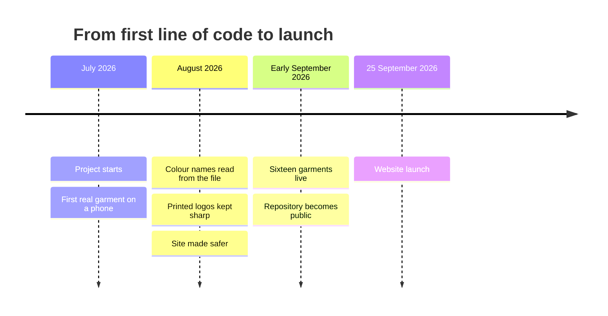

# Changelog

> **What is this?** A short list of what changed, newest first.
> Each version is named by its date, like `2026.09.25`.
> The full detail of every change is in the [pull requests](https://github.com/hateem2121/RUN-APPAREL-W.D/pulls?q=is%3Apr+is%3Amerged).

The layout follows [Keep a Changelog](https://keepachangelog.com/en/1.1.0/).
Versions use the date they went live (owner's choice, 2026-09-26).

## [Unreleased]

### Added

- A picture-first front page, with a door each for RUN staff, developers and AI agents.
- A picture guide for RUN staff, in six short pages.
- A code of conduct, a help page, and three simple forms for reporting a problem.
- A robot that checks every picture has a description and every diagram draws.

### Changed

- Every outside package moved to its newest stable version ([#72](https://github.com/hateem2121/RUN-APPAREL-W.D/pull/72)).
- Error reports now use Sentry 11, and the privacy page says exactly what they include ([#72](https://github.com/hateem2121/RUN-APPAREL-W.D/pull/72)).
- The last fixes from the launch checklist ([#71](https://github.com/hateem2121/RUN-APPAREL-W.D/pull/71)).
- The AI instruction files are shorter, and each rule sits where it applies.

### Fixed

- The script that draws the website's sharing picture runs again after the test-tool upgrade.

## [2026.09.25] — the website launch

The public website at [wear-run.help](https://wear-run.help) opened to search engines ([#69](https://github.com/hateem2121/RUN-APPAREL-W.D/pull/69)).
This version holds 60 changes made between 10 and 25 September 2026.

### Added

- A home page with an "Inside the factory" photo strip ([#67](https://github.com/hateem2121/RUN-APPAREL-W.D/pull/67)).
- Private links for our catalogue and company profile, with visit records ([#12](https://github.com/hateem2121/RUN-APPAREL-W.D/pull/12), [#16](https://github.com/hateem2121/RUN-APPAREL-W.D/pull/16)).
- One shared menu bar for the website and the 3D viewer ([#38](https://github.com/hateem2121/RUN-APPAREL-W.D/pull/38)).
- The viewer notices a 3D download that stops, and offers to try again ([#43](https://github.com/hateem2121/RUN-APPAREL-W.D/pull/43)).
- Test robots for phones, screen readers, speed, layout and colour.

### Changed

- Smooth scrolling on the website, like the viewer's ([#62](https://github.com/hateem2121/RUN-APPAREL-W.D/pull/62)).
- Our reply promise is 24 hours everywhere ([#63](https://github.com/hateem2121/RUN-APPAREL-W.D/pull/63)).
- The loading screen and styles arrive with the page, so a slow phone sees something sooner ([#57](https://github.com/hateem2121/RUN-APPAREL-W.D/pull/57)).

### Security

- Backups leave GitHub only in locked (encrypted) form ([#1](https://github.com/hateem2121/RUN-APPAREL-W.D/pull/1)).
- The website runs only scripts it has stamped as its own ([#23](https://github.com/hateem2121/RUN-APPAREL-W.D/pull/23)).
- A security contact file on every web address ([#17](https://github.com/hateem2121/RUN-APPAREL-W.D/pull/17)).

## Earlier history (before this repository went public)

These changes were made in an older, private copy of the code.
Their pull request numbers belong to that copy, so they are not linked here.

### Early September 2026

- Eleven garments went live, then sixteen.
- A product-page check led to 23 fixes for access, search and phones.
- The repository became public on 10 September.

### August 2026

- Colour names are read from the 3D file instead of typed by hand.
- The system refuses to save a garment whose printed logo was damaged.
- The "Smallest file" setting was removed, because it blurred logos.
- Every garment and colour got its own link preview.
- The site was made safer: checked backups, locked-down builds and a non-admin robot.
- The 3D viewer was fixed for small phones.

### July 2026

- The project started on 21 July.
- Uploading a raw 3D file and shrinking it with a robot began to work.
- The first real garment showed in 3D on a phone.
- The first fixes to keep printed logos sharp.
