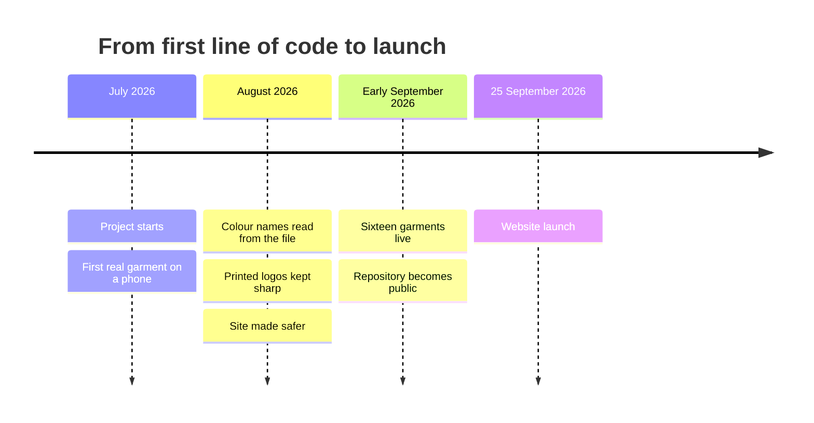

# Changelog

> **What is this?** A short list of what changed, newest first.
> Each version is named by its date, like `2026.09.25`.
> The full detail of every change is in the [pull requests](https://github.com/hateem2121/RUN-APPAREL-W.D/pulls?q=is%3Apr+is%3Amerged).

The layout follows [Keep a Changelog](https://keepachangelog.com/en/1.1.0/).
Versions use the date they went live (owner's choice, 2026-09-26).

```mermaid
timeline
  title From first line of code to launch
  July 2026 : Project starts : First real garment on a phone
  August 2026 : Colour names read from the file : Printed logos kept sharp : Site made safer
  Early September 2026 : Sixteen garments live : Repository becomes public
  25 September 2026 : Website launch
```

## [Unreleased]

### Added

- The buyer guide library grew to 34 guides: soccer balls and how we write our guides, fifteen new guides with four deepened, the order and minimum-order guides, the tech-pack guide with its free template, the vetting guide's SECP check, and the glossary terms the guides name ([#329](https://github.com/hateem2121/RUN-APPAREL-W.D/pull/329), [#331](https://github.com/hateem2121/RUN-APPAREL-W.D/pull/331), [#332](https://github.com/hateem2121/RUN-APPAREL-W.D/pull/332), [#333](https://github.com/hateem2121/RUN-APPAREL-W.D/pull/333), [#334](https://github.com/hateem2121/RUN-APPAREL-W.D/pull/334)).
- A page for the Sports Accessories range and a page for custom soccer balls ([#305](https://github.com/hateem2121/RUN-APPAREL-W.D/pull/305)).
- Search engines are told which guides and which pages changed, through Bing's IndexNow ([#346](https://github.com/hateem2121/RUN-APPAREL-W.D/pull/346), [#351](https://github.com/hateem2121/RUN-APPAREL-W.D/pull/351)).
- Desktop hero photos come in AVIF, and every page is warmed in Pakistan after a deploy so no buyer meets a cold one ([#319](https://github.com/hateem2121/RUN-APPAREL-W.D/pull/319)).
- CI runs every workflow from GitHub's lockfile, which also locks the actions our actions use ([#347](https://github.com/hateem2121/RUN-APPAREL-W.D/pull/347)), installs Trivy from its GitHub release with a pinned checksum ([#313](https://github.com/hateem2121/RUN-APPAREL-W.D/pull/313)), and tests each new version before visitors get it ([#341](https://github.com/hateem2121/RUN-APPAREL-W.D/pull/341)).

- PostHog, under the same cookie question: for visitors who press Accept, it records how they use each page (clicks, scrolling, the 3D viewer) so the owner can watch the visit back. What anyone types into a form is hidden before it leaves their browser.
- A cookie question on every page. Google Analytics and Apollo (which shows which companies visit) start only if a visitor presses Accept; nothing is stored before that. A "Cookies" link in the footer of every page brings the question back.
- A picture-first front page, with a door each for RUN staff, developers and AI agents.
- A picture guide for RUN staff, in six short pages.
- A code of conduct, a help page, and three simple forms for reporting a problem.
- A robot that checks every picture has a description and every diagram draws.
- Search robots now read each garment's name, picture, description and colours on its page, not only in hidden data.
- The sitemap tells Google when each garment last changed and where its picture is.
- A one-command check of every page for search problems (`node scripts/seo-crawl.mjs`).
- Four buyer pages, one each for Teamwear, Sportswear, Outerwear and Casual Wear: what is made, the minimum, the sample time, how an order works and six common questions. The home page's family cards now open them.
- Three buyer guides under `/guides`: how a private label order works, the 3D garment reference explained, and minimum order and samples. A "Guides" link in the footer of every website page opens them.
- Three more buyer guides: garment printing methods, sportswear fabrics and weights, and private label packaging.
- A guide to shipping and import duties: the four ways an order ships and the price terms quoted.
- The Sports Accessories card on the home page shows a photo of RUN backpacks instead of "Photo to come".
- Each garment can carry a plain garment type ("Women's Tennis Dress"), and its page title now says it.

- New website pages: policies, careers, community, a careers form, questions and answers, a word list, a journal, case studies and a press page ([#141](https://github.com/hateem2121/RUN-APPAREL-W.D/pull/141), [#143](https://github.com/hateem2121/RUN-APPAREL-W.D/pull/143)).
- The about page and an inside-the-factory page with photos ([#154](https://github.com/hateem2121/RUN-APPAREL-W.D/pull/154)).
- Buyer guides, a file AI assistants can read about the company, and 3D model data search engines understand ([#139](https://github.com/hateem2121/RUN-APPAREL-W.D/pull/139), [#152](https://github.com/hateem2121/RUN-APPAREL-W.D/pull/152)).
- The Structure Polo Set is on the site with its pictures, marked "3D coming soon" while its 3D file is redone ([#149](https://github.com/hateem2121/RUN-APPAREL-W.D/pull/149)).
- Forms show upload progress, and the site keeps working when a visitor's browser translates the page ([#181](https://github.com/hateem2121/RUN-APPAREL-W.D/pull/181)).
- High-contrast colours for people who switch them on, built into the design system ([#216](https://github.com/hateem2121/RUN-APPAREL-W.D/pull/216), [#218](https://github.com/hateem2121/RUN-APPAREL-W.D/pull/218), [#223](https://github.com/hateem2121/RUN-APPAREL-W.D/pull/223)).

### Changed

- Garment pages: the print is whole from the first frame, the right colour from the first frame, the stitched piece asks at its own address so no browser refuses it, the woven mark arrives with the opening screen, and the photo and its seam share one download ([#296](https://github.com/hateem2121/RUN-APPAREL-W.D/pull/296), [#300](https://github.com/hateem2121/RUN-APPAREL-W.D/pull/300), [#302](https://github.com/hateem2121/RUN-APPAREL-W.D/pull/302), [#303](https://github.com/hateem2121/RUN-APPAREL-W.D/pull/303), [#304](https://github.com/hateem2121/RUN-APPAREL-W.D/pull/304), [#311](https://github.com/hateem2121/RUN-APPAREL-W.D/pull/311)).
- The website has a first-arrival curtain on every page and a woven tap between pages ([#297](https://github.com/hateem2121/RUN-APPAREL-W.D/pull/297), [#299](https://github.com/hateem2121/RUN-APPAREL-W.D/pull/299)).
- Visitor counting starts when the page is quiet — 3 seconds after Accept, one tracker at a time ([#312](https://github.com/hateem2121/RUN-APPAREL-W.D/pull/312), [#315](https://github.com/hateem2121/RUN-APPAREL-W.D/pull/315)).
- Google Analytics counts a tap on the WhatsApp, phone or inquiry-email link ([#295](https://github.com/hateem2121/RUN-APPAREL-W.D/pull/295)).
- The Working block says "Almost done" only near the end, and the Kaizen ball joins the live checks ([#301](https://github.com/hateem2121/RUN-APPAREL-W.D/pull/301), [#306](https://github.com/hateem2121/RUN-APPAREL-W.D/pull/306)).
- Buyer pages and the About page show their photos whole, as a screen's background ([#325](https://github.com/hateem2121/RUN-APPAREL-W.D/pull/325)); every buyer page links to the factory page, which names the garment wash tests ([#322](https://github.com/hateem2121/RUN-APPAREL-W.D/pull/322)); a "What we make" line opens what it names ([#307](https://github.com/hateem2121/RUN-APPAREL-W.D/pull/307)); the accessory pages say products and the ball page leads with a logo ([#308](https://github.com/hateem2121/RUN-APPAREL-W.D/pull/308)).
- The About page tells the company's relationships and history correctly: DURUS INDUSTRIES is our sister company, not our parent; no GOTS claims; the standards bodies' logos are off because none is ours to show; the huge year behind M. Iqbal Sandal's portrait is 1956, dark enough to read ([#320](https://github.com/hateem2121/RUN-APPAREL-W.D/pull/320), [#324](https://github.com/hateem2121/RUN-APPAREL-W.D/pull/324), [#326](https://github.com/hateem2121/RUN-APPAREL-W.D/pull/326), [#327](https://github.com/hateem2121/RUN-APPAREL-W.D/pull/327)).
- The footer's SECP line says "Both companies", not "Group" ([#323](https://github.com/hateem2121/RUN-APPAREL-W.D/pull/323)), and a tagged link uses the stored page ([#310](https://github.com/hateem2121/RUN-APPAREL-W.D/pull/310)).
- A long spec is shortened before the colour is, so each colour page keeps its own description ([#336](https://github.com/hateem2121/RUN-APPAREL-W.D/pull/336)).
- R-VPJ's raw export is fingerprinted, so its live model can be rebuilt exactly ([#350](https://github.com/hateem2121/RUN-APPAREL-W.D/pull/350)).
- The R2 copies of the database now expire: nightly after 30 days, pre-deploy after 14 ([#339](https://github.com/hateem2121/RUN-APPAREL-W.D/pull/339)), and the daily settings check reads only what a workflow token may, so it compares again ([#345](https://github.com/hateem2121/RUN-APPAREL-W.D/pull/345)).
- Scorecard's "not pinned by hash" results stop reaching Code scanning ([#354](https://github.com/hateem2121/RUN-APPAREL-W.D/pull/354)).
- The weekly agent-skills robot keeps the vendored skills at their upstream versions and no longer redeploys the website ([#309](https://github.com/hateem2121/RUN-APPAREL-W.D/pull/309), [#328](https://github.com/hateem2121/RUN-APPAREL-W.D/pull/328)); a note records that only `main` may use the production secrets ([#338](https://github.com/hateem2121/RUN-APPAREL-W.D/pull/338)).

- The home page was rebuilt section by section: the roof photo with four figures, an order in four stage cards, family cards that open with their lists, and one ask at the end ([#194](https://github.com/hateem2121/RUN-APPAREL-W.D/pull/194), [#195](https://github.com/hateem2121/RUN-APPAREL-W.D/pull/195), [#197](https://github.com/hateem2121/RUN-APPAREL-W.D/pull/197), [#199](https://github.com/hateem2121/RUN-APPAREL-W.D/pull/199), [#200](https://github.com/hateem2121/RUN-APPAREL-W.D/pull/200), [#203](https://github.com/hateem2121/RUN-APPAREL-W.D/pull/203)).
- The home page's title now says "private label sportswear", and every buyer page links two buyer guides ([#231](https://github.com/hateem2121/RUN-APPAREL-W.D/pull/231)).
- Faster on phones: the products page lays out sooner, Archivo is cut to the widths the site uses (a third smaller on a first visit), the garment page paints in 868 ms instead of 2,304 ms on slow 3G, and garment data answers from cache ([#142](https://github.com/hateem2121/RUN-APPAREL-W.D/pull/142), [#206](https://github.com/hateem2121/RUN-APPAREL-W.D/pull/206), [#213](https://github.com/hateem2121/RUN-APPAREL-W.D/pull/213), [#214](https://github.com/hateem2121/RUN-APPAREL-W.D/pull/214)).
- Search robots get each garment's picture and words in the page itself, so Google never reads a slow 3D load as an empty page ([#220](https://github.com/hateem2121/RUN-APPAREL-W.D/pull/220), [#232](https://github.com/hateem2121/RUN-APPAREL-W.D/pull/232)).
- Colour names say their colour, and the muted and volt colours are dark enough to read on every light background ([#131](https://github.com/hateem2121/RUN-APPAREL-W.D/pull/131), [#222](https://github.com/hateem2121/RUN-APPAREL-W.D/pull/222)).
- The shrink robot's container runs on Debian 13 ([#211](https://github.com/hateem2121/RUN-APPAREL-W.D/pull/211)).
- This repository's instructions, guides and code comments were checked against the live site and the code, and corrected where they had gone out of date; CI now runs on Node 26; the unused Cloudflare Pages rollback was removed, and 39 finished plans, specs, session logs and other old records were deleted (each is still readable at commit bd384f3c).

- Every outside package moved to its newest stable version ([#72](https://github.com/hateem2121/RUN-APPAREL-W.D/pull/72)).
- Error reports now use Sentry 11, and the privacy page says exactly what they include ([#72](https://github.com/hateem2121/RUN-APPAREL-W.D/pull/72)).
- The last fixes from the launch checklist ([#71](https://github.com/hateem2121/RUN-APPAREL-W.D/pull/71)).
- The AI instruction files are shorter, and each rule sits where it applies.
- The company's LinkedIn and Instagram, already in the footer, are now also in the data search engines read.
- The products page's title in search results now says what is sold, in the owner's words.
- One misspelled garment name is corrected (RAGLAN).
- Visits from a developer's machine or a test are marked internal, so Google Analytics counts real visitors only.

### Fixed

- A deploy no longer empties the garment data in every buyer region ([#318](https://github.com/hateem2121/RUN-APPAREL-W.D/pull/318)).
- A database dump now loads back into D1: tables and rows go parents first; the R2 restore drill was run from the encrypted mirror and worked, next due 7 February ([#348](https://github.com/hateem2121/RUN-APPAREL-W.D/pull/348), [#344](https://github.com/hateem2121/RUN-APPAREL-W.D/pull/344)), and a GitHub download outage no longer skips the night's backup ([#349](https://github.com/hateem2121/RUN-APPAREL-W.D/pull/349)).
- The deploy's version proof accepts a live version that predates the version address ([#343](https://github.com/hateem2121/RUN-APPAREL-W.D/pull/343)).
- glob and minimatch move to their patched majors, clearing two security alerts ([#321](https://github.com/hateem2121/RUN-APPAREL-W.D/pull/321)).
- Privacy: template-download records are kept for exactly two calendar years, and records without an updates yes are deleted automatically two years after the last contact ([#335](https://github.com/hateem2121/RUN-APPAREL-W.D/pull/335), [#337](https://github.com/hateem2121/RUN-APPAREL-W.D/pull/337)).
- Fact-check fixes: the soccer-ball and fabrics guides, the UK regulator's new name, "eco-poly" removed, and France's "weaving" now includes knitting ([#330](https://github.com/hateem2121/RUN-APPAREL-W.D/pull/330), [#340](https://github.com/hateem2121/RUN-APPAREL-W.D/pull/340)).
- Cards show their dye first, with no halo on the garment's stitched piece ([#298](https://github.com/hateem2121/RUN-APPAREL-W.D/pull/298)).
- The footer's last-word split is a scan from the end, so a long question cannot stall a page ([#353](https://github.com/hateem2121/RUN-APPAREL-W.D/pull/353)).
- Two test repairs: the blurred-photo test no longer races the seam, and a test comment no longer says the fixture posters are opaque ([#314](https://github.com/hateem2121/RUN-APPAREL-W.D/pull/314), [#316](https://github.com/hateem2121/RUN-APPAREL-W.D/pull/316)).
- Every public page — the README, the wiki, the security policy, the contributor and developer guides, the runbook, the changelog and the picture guide — was checked claim by claim against the code and corrected: a dead index link now opens the archived copy, the file-count chart is counted again, one measured number for the 3D test suite everywhere, today's schedules and test count in the developer guide, the older QR tags, fresh screenshots, and the docs-index gate now catches a link to a deleted file (the failure class this pass found).

- A garment's 3D download now retries temporary connection failures within one three-attempt limit, then offers the picture and a way to try again. A failed picture can also be retried.
- New and replacement 3D files are refused when their embedded images cannot be checked or exceed the image limits. The shrink robot stops if it cannot process a texture, instead of silently keeping that texture in the finished file. Real-phone artwork and memory checks are still required.
- The RUN APPAREL footer lettering keeps its fit when the page changes width or the font finishes loading, including with reduced motion switched on.
- The scheduled live check now completes selected garment downloads and checks their image limits. Access denials remain visibly unverified; repeated server failures fail the check.
- The website no longer fails with Error 1101 under heavy traffic ([#145](https://github.com/hateem2121/RUN-APPAREL-W.D/pull/145)).
- Google Analytics visits are no longer lost ([#176](https://github.com/hateem2121/RUN-APPAREL-W.D/pull/176)).
- A crash no longer tells buyers a garment was discontinued ([#188](https://github.com/hateem2121/RUN-APPAREL-W.D/pull/188)).
- A garment page left open during an update reloads once and shows the garment in 3D, instead of a notice ([#217](https://github.com/hateem2121/RUN-APPAREL-W.D/pull/217)).
- Safari's bottom strip on iPhone matches the page again ([#211](https://github.com/hateem2121/RUN-APPAREL-W.D/pull/211)).
- Two critical security advisories in Next.js are closed ([#223](https://github.com/hateem2121/RUN-APPAREL-W.D/pull/223)).
- The live check now looks inside every 3D file. Two garments with large files (R-TTP and R-MSS) were skipped without a word; both turned out clean.
- The public security grade (OpenSSF Scorecard) no longer counts 12 known advisories: nine are fixed by moving two packages to their patched releases, and the three with no fix anywhere, all inside the speed-test tool, are excused with the same reasons the deploy gate already gives.
- The public "report a problem" forms and the contributor guide are current: the example address is the website's, the "garment looks wrong" link opens the steps that help instead of a case closed in August, and the test numbers are today's.
- The daily security check now covers the two newest guides (the cost guide and the country comparison), missed since they went live on 8 October, and fails if a future page is left out the same way.
- The runbook, the design notes, the deep-read notes and the website decisions were checked claim by claim against the code: 100 corrections, among them runbook commands that would have failed today and the order steps the site has drawn since 15 October.
- The shrink robot runs on Node 26 (owner's choice, four days before Node 26 became the long-term-support line). Two real garments came out byte-for-byte identical on Node 24 and Node 26.
- The live speed check stops failing on GitHub's slower machines: its limits were set before GitHub changed its machines on 29 September, and they failed 15 of the last 30 runs with nothing on the site wrong. Re-measured from those 30 runs (owner's choice); a clear slowdown still fails it.
- Four security advisories published on 23 October no longer block the deploy: undici, body-parser, happy-dom and zod 4 now use their fixed versions, and the one copy with no fix (zod 3 inside the Lighthouse speed tool) is listed with its reason.
- Server errors reach Sentry, and the weekly error report no longer counts our own speed robot ([#190](https://github.com/hateem2121/RUN-APPAREL-W.D/pull/190), [#191](https://github.com/hateem2121/RUN-APPAREL-W.D/pull/191)).
- Checks that failed for reasons other than the code: the speed test, the shrink deploy check, the footer probe and several browser tests ([#166](https://github.com/hateem2121/RUN-APPAREL-W.D/pull/166), [#178](https://github.com/hateem2121/RUN-APPAREL-W.D/pull/178), [#180](https://github.com/hateem2121/RUN-APPAREL-W.D/pull/180), [#183](https://github.com/hateem2121/RUN-APPAREL-W.D/pull/183), [#198](https://github.com/hateem2121/RUN-APPAREL-W.D/pull/198), [#201](https://github.com/hateem2121/RUN-APPAREL-W.D/pull/201), [#228](https://github.com/hateem2121/RUN-APPAREL-W.D/pull/228)).

- The weekly model check now reads each model's own size marker instead of a fixed guess, so a larger model no longer turns the check red.
- The script that draws the website's sharing picture runs again after the test-tool upgrade.
- The shrink robot's container gets the same small updates the rest of the code got.
- A garment address that does not exist now answers "not found" to search robots; people still see the helpful page.
- Google can now read the garment pages. A rule meant to keep search engines out of the admin data was also hiding each garment's details from Google, so it refused all 205 pages.

## [2026.09.25] — the website launch

The public website at [wear-run.help](https://wear-run.help) opened to search engines ([#69](https://github.com/hateem2121/RUN-APPAREL-W.D/pull/69)).
This version holds 60 changes made between 10 and 25 September 2026.

### Added

- A home page with an "Inside the factory" photo strip ([#67](https://github.com/hateem2121/RUN-APPAREL-W.D/pull/67)).
- Private links for our catalogue and company profile, with visit records ([#12](https://github.com/hateem2121/RUN-APPAREL-W.D/pull/12), [#16](https://github.com/hateem2121/RUN-APPAREL-W.D/pull/16)).
- One shared menu bar for the website and the 3D viewer ([#38](https://github.com/hateem2121/RUN-APPAREL-W.D/pull/38)).
- The viewer notices a 3D download that stops, and offers to try again ([#43](https://github.com/hateem2121/RUN-APPAREL-W.D/pull/43)).
- Test robots for phones, screen readers, speed, layout and colour.

### Changed

- Smooth scrolling on the website, like the viewer's ([#62](https://github.com/hateem2121/RUN-APPAREL-W.D/pull/62)).
- Our reply promise is 24 hours everywhere ([#63](https://github.com/hateem2121/RUN-APPAREL-W.D/pull/63)).
- The loading screen and styles arrive with the page, so a slow phone sees something sooner ([#57](https://github.com/hateem2121/RUN-APPAREL-W.D/pull/57)).

### Security

- Backups leave GitHub only in locked (encrypted) form ([#1](https://github.com/hateem2121/RUN-APPAREL-W.D/pull/1)).
- The website runs only scripts it has stamped as its own ([#23](https://github.com/hateem2121/RUN-APPAREL-W.D/pull/23)).
- A security contact file on every web address ([#17](https://github.com/hateem2121/RUN-APPAREL-W.D/pull/17)).

## Earlier history (before this repository went public)

These changes were made in an older, private copy of the code.
Their pull request numbers belong to that copy, so they are not linked here.

### Early September 2026

- Eleven garments went live, then sixteen.
- A product-page check led to 23 fixes for access, search and phones.
- The repository became public on 10 September.

### August 2026

- Colour names are read from the 3D file instead of typed by hand.
- The system refuses to save a garment whose printed logo was damaged.
- The "Smallest file" setting was removed, because it blurred logos.
- Every garment and colour got its own link preview.
- The site was made safer: checked backups, locked-down builds and a non-admin robot.
- The 3D viewer was fixed for small phones.

### July 2026

- The project started on 21 July.
- Uploading a raw 3D file and shrinking it with a robot began to work.
- The first real garment showed in 3D on a phone.
- The first fixes to keep printed logos sharp.
