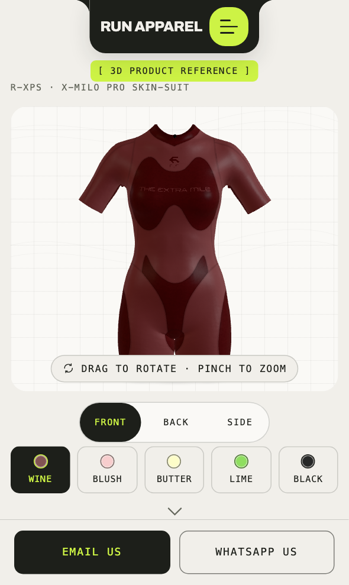
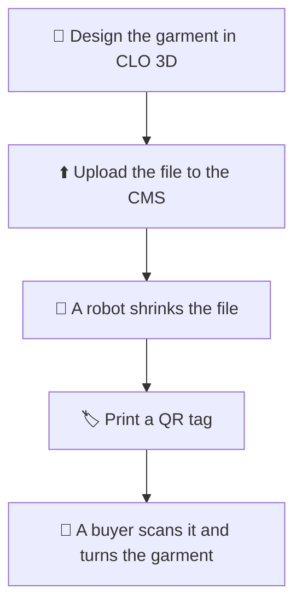
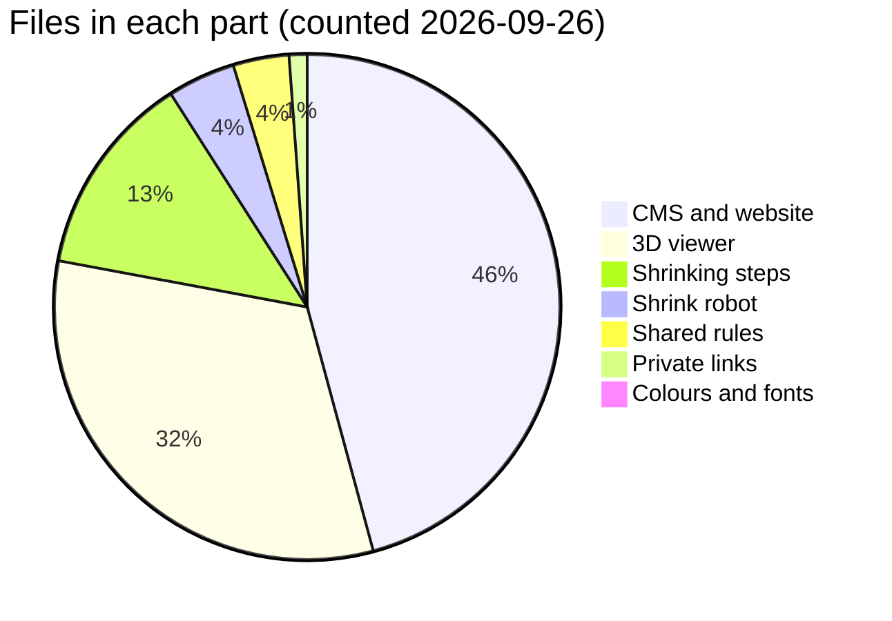
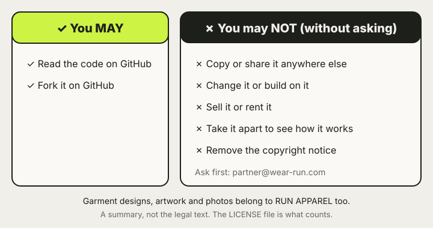

# RUN APPAREL — see every garment in 3D

> **What is this?** RUN APPAREL makes clothes for brands and teams.
> This code shows each garment in 3D on a phone.
> A buyer scans the QR code on a tag, then turns the garment and zooms in on the print.
> There is no shop, no cart and no prices. It is a reference for our partners.

  <picture>
    <source media="(prefers-color-scheme: dark)" srcset="docs/images/viewer-phone-dark.png">
    
  </picture>

## 🧭 How it works

CLO 3D is the program we design clothes in.
The CMS (content management system) is the website where we keep our products.
The robot makes the 3D file small enough for a phone, and keeps the print sharp.
[The full trip, with pictures →](docs/guide/how-it-works.md)

## 🧵 Why it matters

For a buyer, **the printed artwork is the product**.
A 3D garment that loads but shows a blurry logo has failed.
So we judge every garment by its print, on a real phone.

| ✅ Success | ❌ Not success |
| --- | --- |
| The logo is sharp when you zoom in | "The 3D loads" |

## 🌍 Live links

| What | Link |
| --- | --- |
| Our website | [wear-run.help](https://wear-run.help) |
| A garment in 3D | [viewer.wear-run.help/rxps/wine](https://viewer.wear-run.help/rxps/wine) |
| The CMS (staff only) | [cms.wear-run.help/admin](https://cms.wear-run.help/admin) |

## 🚪 Pick your door

| I am… | Start here |
| --- | --- |
| 🧵 On the RUN team | [The picture guide](docs/guide/README.md) — short pages, no code |
| 🛠️ A developer | [Developing](docs/DEVELOPING.md), then [Contributing](CONTRIBUTING.md) |
| 🤖 An AI agent | [AGENTS.md](AGENTS.md) and [CLAUDE.md](CLAUDE.md) |

Every document is listed in [docs/README.md](docs/README.md).

## 📦 What's inside

| Folder | What it does | Who uses it |
| --- | --- | --- |
| `apps/viewer` | The 3D page a buyer sees | Buyers |
| `apps/cms` | The CMS, its data and our website | RUN staff and visitors |
| `apps/shrink` | The robot that shrinks 3D files | Runs by itself |
| `tools/asset-pipeline` | The shrinking steps the robot follows | The robot and developers |
| `packages/shared` | Rules every part must agree on | All the parts |
| `packages/ui` | Our Paper and Ink colours and fonts | All the pages |
| `infra/apex-404` | Private links to our catalogue and profile | Partners we send them to |

## 🔧 Held on purpose

`@cloudflare/workers-types` stays at `5.20260804.1` in `apps/shrink` — see [docs/DEPENDENCY-HOLDS.md](docs/DEPENDENCY-HOLDS.md).

## 🆘 Help, 🔒 security, 📜 licence, 🤝 conduct

- 🆘 **Need help?** See [SUPPORT.md](SUPPORT.md), or email team@wear-run.com.
- 🔒 **Found a security problem?** Email privately. [SECURITY.md](SECURITY.md) explains how. Never open a public issue for it.
- 📜 **Licence:** this code is not open source. You may read it and fork it on GitHub. See [LICENSE](LICENSE).
- 🤝 **Conduct:** be kind and honest. See [CODE_OF_CONDUCT.md](CODE_OF_CONDUCT.md).

## 📚 Words we use

| Word | Plain meaning |
| --- | --- |
| 3D model | A garment you can turn around on a screen |
| CMS | The website where we keep our products |
| Colourway | One colour version of a garment |
| QR code | A square barcode a phone camera can open |
| Deploy | Putting a new version of the site live |
| Repository | This folder of code on GitHub |

More words are in the [full word list](docs/guide/glossary.md).
