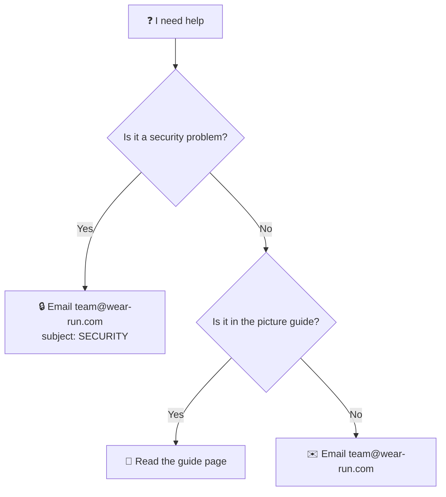

# 🆘 Getting help

> **What is this?** Where to go when you need help with the site or this code.
> Find your question below and follow the link.

## 🧭 Where do I go?

| My question | Go here |
| --- | --- |
| A garment looks wrong on the site | [When something looks wrong](docs/guide/when-something-looks-wrong.md) |
| How do I upload a garment? | [Upload a garment](docs/guide/upload-a-garment.md) |
| What does this word mean? | [Words we use](docs/guide/glossary.md) |
| The site is down or broken | [Open a "site broken" issue](https://github.com/hateem2121/RUN-APPAREL-W.D/issues/new/choose) |
| I found a security problem | [Tell us privately](SECURITY.md). **Never** in a public issue. |
| I want to change the code | [Contributing](CONTRIBUTING.md) |
| Anything else | Email **team@wear-run.com** |

## ⏱️ When will I hear back?

This project has one maintainer.
We try to reply within 3 working days.

## 🧵 Why it matters

The right place gets you the fastest answer.
A security problem in a public issue can put everyone at risk.
That is why it always goes by private email.
