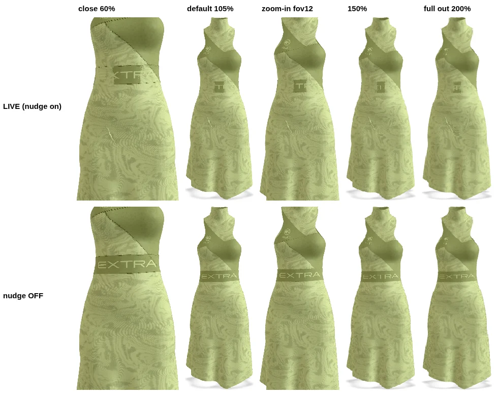
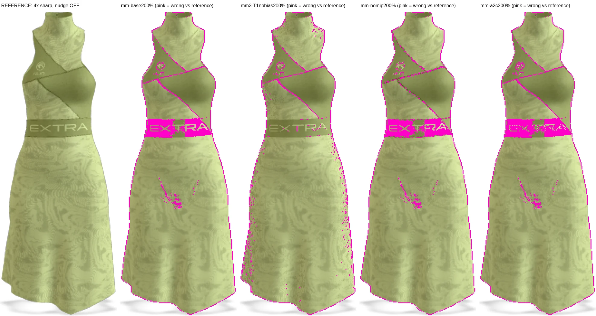
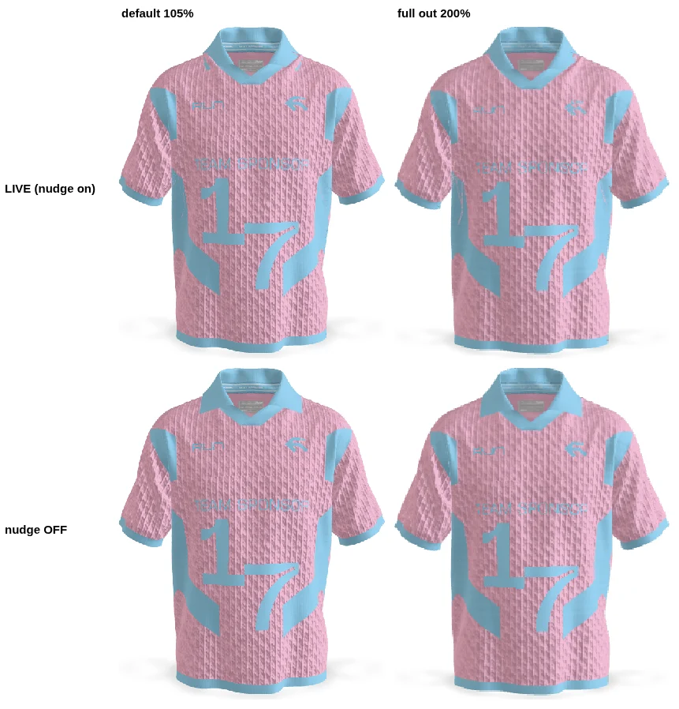
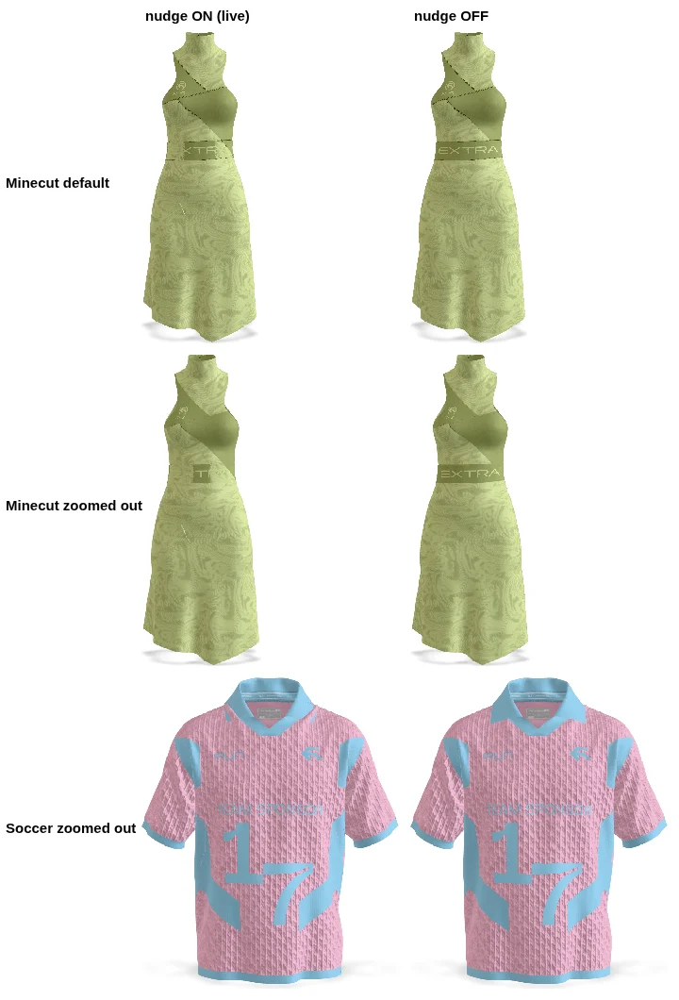
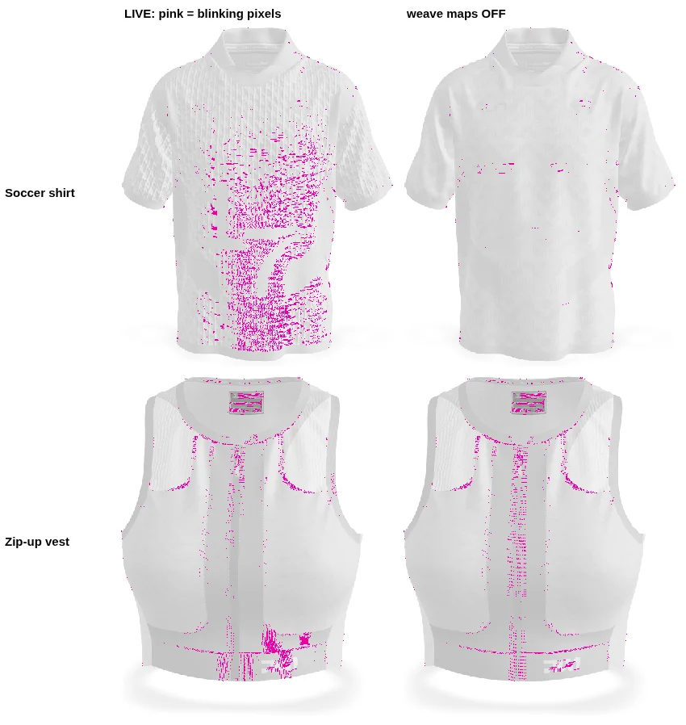
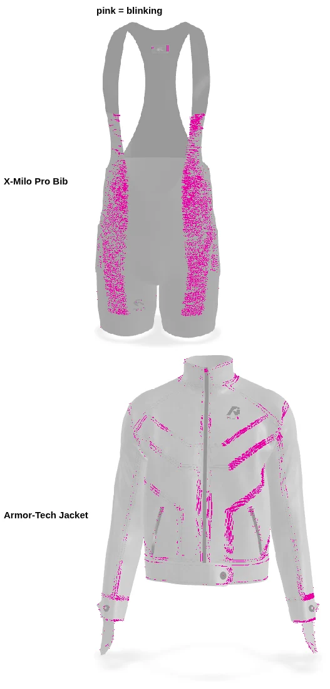

# 3D viewer forensics — 2026-09-27

A read-only investigation into four problems the owner reported on the live 3D viewer:

1. parts vanish when zoomed out;
2. a white flicker that was fixed before is back;
3. CLO "blend" graphics render solid;
4. some garments look lower quality than in CLO.

Nothing in the code, the database or the live site was changed. This folder is a dated
**record** of what was measured on that day. Do not edit it to keep it "current".

| File | What it is |
|---|---|
| `report.html` | The interactive report: charts, pictures, severity table and checklist. Open it in a browser. |
| `final-report.html` | The merged final report of both sessions (cloud and local), in plain English, using the pictures in `evidence/` and `evidence/local/`. Open it in a browser. |
| [LOCAL-SESSION-PROMPT.md](LOCAL-SESSION-PROMPT.md) | The prompt for a local session that continues with the raw CLO exports |
| [local-session-2026-09-27.md](local-session-2026-09-27.md) | What that local session found, with its own evidence, data and scripts under `local/` subfolders |
| `evidence/` | The before/after pictures cited below |
| `data/` | Raw measurements from the render runs |
| `scripts/` | The exact scripts that produced them (Playwright against the live site) |

**Labels:** ✅ proven by code, a live file or a live render · 🔍 strong evidence · ❓ untested idea.

## 1. Parts invisible when zoomed out: the anti-flicker nudge over-reaches ✅ 95%

**In plain words.** A print sits a hair above the cloth, so the computer can't tell which is in
front. The fix pushes the print toward the viewer. But the push is measured in screen dots, and
when you zoom out each dot covers more garment, so the push grows. On Minecut Motion it grows
enough to shove the marble print in front of the "EXTRA" waistband that really sits on top of it.

- The nudge is set in `apps/viewer/src/lib/decal-depth-bias.ts:145` (factor and units both −8).
  It applies to cut-outs, and to layers that `tools/asset-pipeline/src/overlay-annotate.ts`
  marked in the file.
- Switching off only the nudge on Minecut's `Material_Graphic` gives exactly the same picture as
  switching off every nudge. That one nudge is the cause.
- With factor 0 and units −8 the picture is identical to "no nudge". The per-pixel (factor)
  part does all the work, and that is the part that grows when zoomed out. At full zoom-out
  one pixel covers about 3.4 mm of garment.
- Against a 4× sharp reference **with the nudge off**, the live zoomed-out Minecut is wrong on
  6.28% of the garment (91% of it too pale). With the nudge off it is 3.55%, and the remainder
  is edge smoothing plus skirt-edge speckles.
  (A first reference was rendered with the nudge on and so hid the waistband too. It was
  replaced.)
- Minecut is affected from the front, side and back (2.8–6.5% of the garment changes), in Sage
  and Blush alike, and on an iPhone-sized screen (1.3–3.2%).
- Classic Soccer Shirt: the same defect pushes the pink print through the blue collar
  (0.45–1.37%). These are the only two garments with a nudge on a large solid print.
- Geovent Tennis Dress: the nudge **helps**. Without it the camouflage print breaks into holes.
  The other 13 garments show no visible harm (under 1% change).
- The nudge is still needed: without it Minecut's skirt edges speckle. A fix must weaken the
  push at a distance, not delete it.
- Why the repo's checks missed it:
  - the strength was tuned "from a fixed camera" (`decal-depth-bias.ts:125`);
  - its safety measurement used a garment with no nudged solid print;
  - the browser test counts that the nudge is *applied*, not how a zoomed-out garment looks.
- Ruled out:
  - frustum culling: model-viewer sets `frustumCulled = false` on every node;
  - the far plane: always at least twice the camera distance;
  - level-of-detail switching: none exists;
  - depth precision: the adaptive near plane in `apps/viewer/src/lib/camera-near-plane.ts`
    is live, reading 1.89 m at full zoom-out;
  - mipmaps: turning them off moved the error only from 6.28% to 6.08%;
  - alpha-to-coverage: it made it worse, 6.57%.

## 2. White flicker: four garments, four causes ✅ 85%

"Blink" = a pixel that changes and changes back while the garment turns in 0.5° steps (plain
motion doesn't do that). It is reported as a share of garment pixels at the default view.

| Garment | Blink (front) | Cause, found by hiding one part at a time |
|---|---|---|
| X-Milo Pro Bib | 0.94% (back 1.16%) | Cut-out side-panel print. Hiding it: 0.004%. Alpha-to-coverage on cut-outs: 0.09% (−91%). |
| Classic Soccer Shirt | 0.64% | Knit normal map. Normal maps off: 0.03% (−95%). three.js specular anti-aliasing reads only the geometric normal. |
| Armor-Tech Jacket | 0.54% | `Default Topstitch`, stored as see-through strips. Hiding it: 0.01%. |
| Women Zip-Up Vest | 0.27% | Topstitch (hiding it: 0.13%) plus cut-out edges (alpha-to-coverage: 0.16%). The zip parts themselves: no effect. |
| The other 12 | under 0.2% | — |

- The old fixes work. The near plane is live, and on Minecut the nudge cuts blinking from
  0.27% to 0.02%.
- Making surfaces less shiny changed nothing on the Bib, the Jacket or the Vest.
- Risk to watch: on 10 of 14 garments the closest print sits less than two position-grid
  steps from its cloth. The shrink report's own warning is written by
  `tools/asset-pipeline/src/precision.ts`. On those garments only the nudge separates print
  and cloth. 66 layers were "held for review" and got no nudge (27 on Endurance Tracksuit).

## 3. CLO "blend" graphics render solid ✅ 75%

- The shrink robot records what CLO wrote before touching the file. In all 14 reports, almost
  every listed print arrived at "opacity 100%". Only The Aggressor Jersey and Geovent Tennis
  Dress list 5 faint prints each.
- glTF 2.0 has only three alpha modes. Its BLEND mode is the Porter-Duff "over" operator; there
  is no multiply or overlay.
- The pipeline's sorting rule is `tools/asset-pipeline/src/textures.ts:457-470`. Across the 14
  reports: 180 materials made solid, 440 made cut-outs, 188 kept see-through.
- Faint prints that CLO did export are kept faint: "Skull" at 13%, "Asset 2" at 16%.
- 140 of 447 print materials carry no normal map, so fabric cannot "show through" them. This
  count is 🔍: it sorts materials by name.
- `tools/asset-pipeline/src/raw-census.ts:360` already warns that CLO does not export a
  graphic's opacity map.

Still open: tracing one named "blend" print end to end (needs the owner's example and the raw
export).

## 4. Low quality ✅ 70%

- File size is not the limit: shipped files are 1.8–7.8 MB against the 40 MB ceiling in
  `packages/shared/src/media.ts`.
- All 14 shrink reports store "balanced". Five were upgraded automatically (raw file under
  50 MB). Mesh decimation ran on only 2 of 14, so the Detail setting changes little.
- A print was shrunk to the 4096-pixel cap on 9 of 14 garments.
- Phone graphics memory reaches 224 MB (The Aggressor Uniform), 201 MB and 192 MB, against an
  iPhone limit of about 256 MB. A single square 8192-pixel print would add about 358 MB.
- Normals are **not** quantized at meshopt level "high"; they keep full precision.
- No refusal gate judges the picture. `apps/shrink/src/specGate.ts` checks glTF validity only.
- Recommendation: do not raise every limit. Raise the cap only for long, thin prints (cheap in
  memory), let phone memory set the cap, and export weave maps at 2048.

## Other findings

- There is no order-independent transparency in three.js 0.183.2 or model-viewer 4.3.1.
- Some fabrics are kept see-through, for example `T3456772LS2` on Women Zip-Up Vest.
- Apex Flex Pullover and Capsule Core Hoodie have no shrink report in the database.
- Armor-Tech Jacket's zipper teeth at 0% strength are intentional (an invisible zipper).

## Method and limits

- **Code read:** the shrink container, the Worker gates, the pipeline, the viewer's two fixes,
  and the sources of model-viewer 4.3.1, three.js 0.183.2 and glTF-Transform 4.5.0.
- **Live files:** the JSON chunk and picture sizes of all 16 live GLBs, read with HTTP range
  requests.
- **Database:** 14 shrink reports, read-only; every query reported no change.
- **Renders:** all 16 live garments in headless Chromium: front, side and back, default and
  full zoom-out, nudge on and off, desktop and an iPhone-sized screen. See `scripts/`.
- In the all-garments run, three first views showed 28–41% changes because the camera had not
  settled. Properly settled measurements from an earlier run (0.01–0.10%) are the valid figures.
- **Not done:** raw CLO exports compared with shipped files (not reachable from the cloud
  session), a real phone, or a named "blend" print. The local session prompt covers these.

## Continuing

The next steps are in [LOCAL-SESSION-PROMPT.md](LOCAL-SESSION-PROMPT.md).
