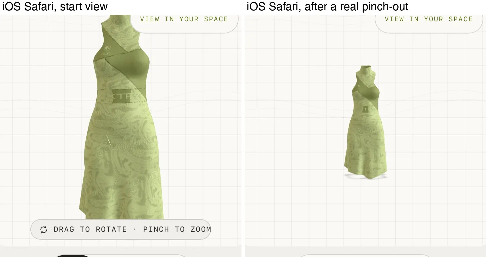
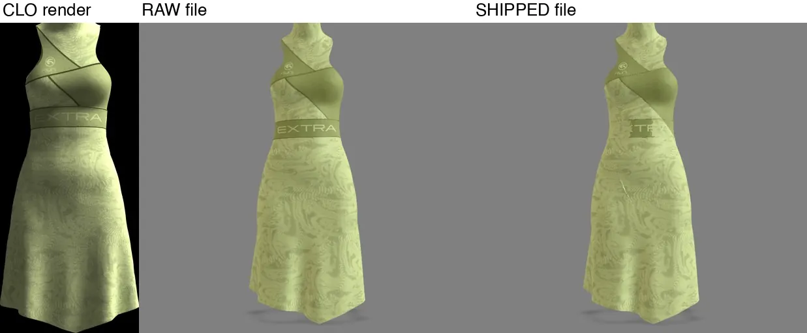
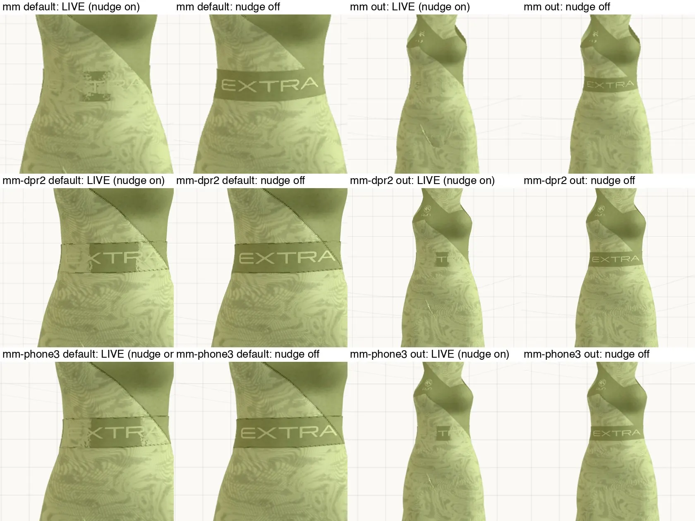
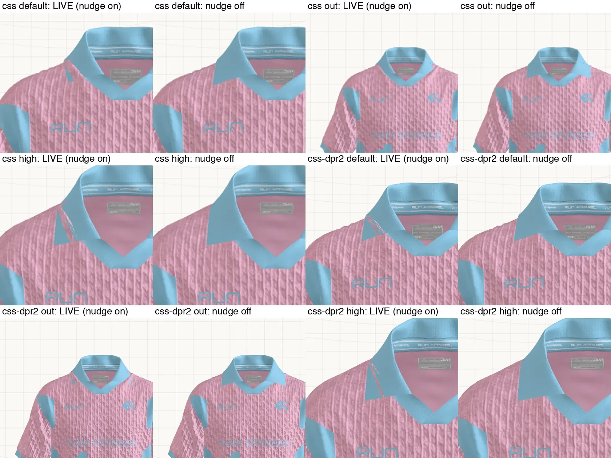
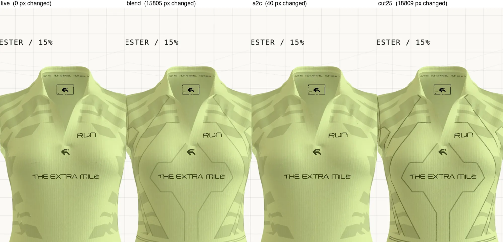
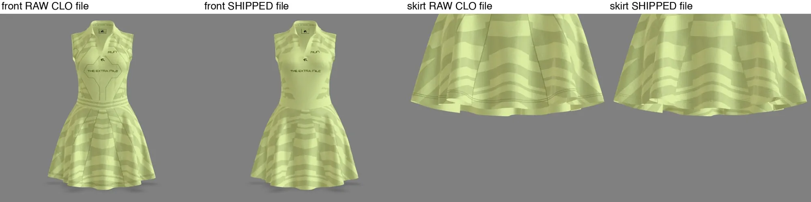
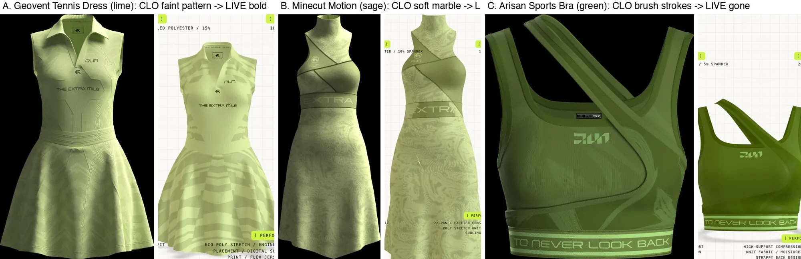
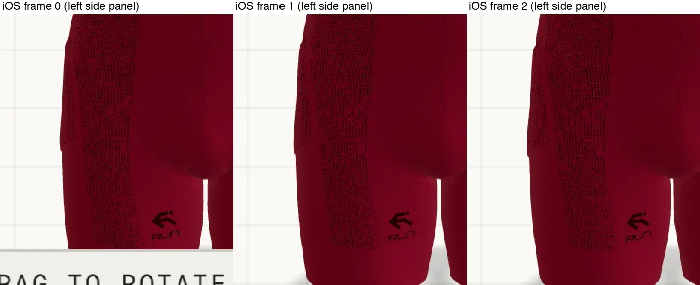
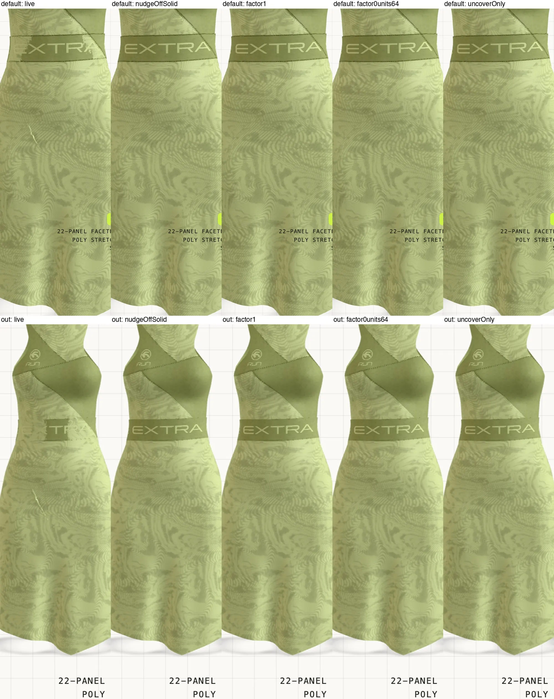
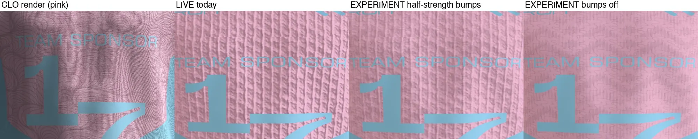

# 3D viewer forensics — the local session, 2026-09-27

The follow-up to [README.md](README.md), run on the owner's Mac with the raw CLO exports and the
owner's CLO renders, as [LOCAL-SESSION-PROMPT.md](LOCAL-SESSION-PROMPT.md) asked. Read-only:
nothing in the code, the database or the live site was changed. Every database query was a SELECT
and every response reported `changed_db: false`. Experiments changed only the in-memory scene of a
browser tab. Like the README, this is a dated **record**; do not edit it to keep it current.

**Labels:** ✅ proven by a file, a render or a live measurement · 🔍 strong evidence · ❓ untested
idea. Each finding names the one test that would settle it.

**Setup, because the numbers depend on it.** Live pages were driven by Playwright in Chromium on
the Mac's own GPU (`--use-angle=metal`), 1000x1100 at 2x, unless a line says otherwise. The cloud
session used SwiftShader at 1x, and several of its numbers do not reproduce here (see 5). The CLO
PNGs are the reference: a render made by CLO itself, with its own studio lighting.

## Corrections to the cloud record

- **The Minecut waistband is hidden at the normal starting view, not only when zoomed out** — at
  1x, 2x and 3x, and in real iOS Safari. The cloud's "invisible when zoomed out" understated it.
- **The Soccer collar is pierced at the normal view too**, at 1x and 2x.
- **Apex Flex Pullover and Capsule Core Hoodie do have shrink reports** (raw uploads #2 and #14).
  Only their links to the result file are broken (see 6).
- **Alpha-to-coverage is not a general fix.** It helps the Bib 15% here, not 91%, and makes five
  garments worse (see 5).

## 1. Why the detector nudged prints that something covers ✅ 95%

- `measureOverlays` decides "is anything in front of me" by casting a ray **2 mm** ahead
  (`SEARCH_MM`, `tools/asset-pipeline/src/overlay-depth.ts:226`).
- On Minecut the layers in front of the nudged marble panel sit **2.5 mm** ahead, just past that:
  the white waistband `Cotton_Canvas_2942` covers **15.7%** of the panel (median gap 2.51 mm) and
  an outer skirt layer `Default Fabric_2900` covers **43.6%** (2.55 mm). The detector saw almost
  none of it, so the panel scored frontness **0.902** and confidence **0.90** and was nudged.
- On the Soccer Shirt the fold-over collar (`Knit_Pique_Jersey_4107475`, piece `m0/p20`) sits
  **2.9–7 mm** ahead of the front print (median 5.3 mm), covering 4.2% of it. Confidence **0.96**.
  The piece under the collar's other side (`m0/p55`, frontness 0.656) was correctly left alone,
  in a cloned material; Minecut got no clone because all five of its print pieces share one
  material, so all five are nudged together.
- The code's own safety argument (`overlay-depth.ts:121-126`) says anything in front of a nudged
  layer "is also detected and biased by the same amount". That holds only inside the 0.3 mm
  z-fight window. A waistband 2.5 mm away is never nudged, so it loses.
- **Held for review:** Minecut raw 3 prints (slogan, gold logo, RUN logo) at confidence
  0.00–0.07, because their gap is exactly 0.300 mm, the edge of the window; Soccer 8 prints at
  0.66–0.68 (gap 0.2 mm). All are cut-outs after processing, so the viewer nudges them anyway
  (`apps/viewer/src/lib/decal-depth-bias.ts:252`). "Held for review" does not mean "left alone".
- **Proof by elimination:** the raw file carries no `depthBias` record. Rendered through
  `pnpm pipeline render`, raw shows the waistband and a clean collar; shipped loses both. Nothing
  else differs between the two renders.

Data: [overlay-detector-minecut-soccer.txt](data/local/overlay-detector-minecut-soccer.txt),
[covering-layers-minecut-soccer.txt](data/local/covering-layers-minecut-soccer.txt). Hiding `m0/p20`
removes the whole collar ([soccer-collar-hide-test.webp](evidence/local/soccer-collar-hide-test.webp)).

## 2. CLO render vs raw export vs shipped file

All 16 live garments were captured front-on in every colourway (80 pictures) and set against the
CLO PNGs; the live variant names keep CLO's own ("Colorway 2"…), so they pair by name. Apex Flex
Pullover, Capsule Core Hoodie and Endurance Tracksuit have **no CLO render** — their only PNG is a
10000x10000 QR code (96% pure black or white). Galleries: `evidence/local/gallery-<slug>.webp`.

**Most differences are already in the raw CLO export.** Rendering the raw file through the repo's
own `pnpm pipeline render` settles each one:

| What looks different | Raw export already looks like live? | Verdict |
|---|---|---|
| Geovent pattern: faint vertical chevrons in CLO, bold horizontal bands live | Yes | Lost in CLO's export ✅ |
| Minecut marble: soft in CLO, bold live | Yes | Lost in CLO's export ✅ |
| Soccer contour lines in CLO, heavy cable-knit bumps live | Yes | Lost in CLO's export ✅ |
| Armor-Tech patent-leather shine | CLO writes roughness 0.40; the pipeline raised it to 0.50 | Not the pipeline ✅ |
| Skin-Suit darker and glossier | Fabric settings identical raw vs shipped | Not the pipeline 🔍 75% |

**Three losses are the pipeline's own:**

1. **The Bib's halftone side panels** ✅. `Material_Graphic` is 4952x7014 raw and **1446x2048**
   shipped — **8.5%** of the pixels. The dots blur (soft pixels 8.3% → **45.3%**, mean ink alpha
   215 → 112), then the cut-out at 0.5 chops each blurred dot, so they shrink, turn blocky and
   flicker. This is the trap `tools/asset-pipeline/CLAUDE.md` already records ("an all-over print
   on BLEND is classified as sheer FABRIC and takes the 2048 cap"; its lever is
   `--max-texture 4096`). The near-black ink colour is CLO's: the raw factor is (0.02, 0, 0).
   Test that settles it: re-run the Bib from its raw export at `--max-texture 4096` and render the
   side panel at 4–7°.
2. **Thin stitch lines vanish** ✅. 12 of the 15 garments with thread ship it as a cut-out
   (`MASK`, cutoff 0.5). From a normal distance a 1-pixel stitch is mostly background, so the whole
   line is cut. Drawing the thread soft (`BLEND`, as CLO exported it) brings back, as a share of
   the garment's pixels: Bib **2.88%**, Geovent **2.54%**, Uniform **2.51%**, 0.4–0.8% on five
   more. On Geovent the hexagon outline around "THE EXTRA MILE" and the princess seams return.
   Data: [hidden-stitching-12-garments.txt](data/local/hidden-stitching-12-garments.txt).
3. **The nudge hides layers** (section 1).

Not a loss: a Soccer print that looked "missing" in a name-keyed size table (`SPONSOR & NUMBER
GRAPHICS Copy 1`) was merged with an identical twin. Piece `p107` still shows the same 626x665
picture as in raw. No artwork was swapped. Data:
[picture-sizes-raw-vs-shipped.txt](data/local/picture-sizes-raw-vs-shipped.txt),
[shine-and-blend-settings.txt](data/local/shine-and-blend-settings.txt).

## 3. The blend prints, end to end

The owner asked for three to be traced. None of them is lost by the pipeline.

- **Geovent `Asset 2`** (a chevron stencil, 1533x4982, exported at **16%**). Shipped keeps BLEND,
  16%, and the colour, at 1260x4096. The live three.js material reads exactly that: dark olive
  `#585e40`, opacity 0.16. Hiding it removes the bold pattern, so it *is* the pattern. The raw file
  already renders the bold horizontal bands, so CLO's own renderer places or blends it differently
  from what it writes. ✅ Lost in CLO's export. Two wrong turns are recorded so nobody repeats
  them: double-siding was ruled out (single-sided changes the darkening only from −21.1 to
  −20.7/255), and a "pattern spread" number was abandoned because CLO's studio shadows on the
  pleats swamped it.
- **Minecut marble** (`Material_Graphic`): OPAQUE and fully solid in raw, identical in shipped. The
  raw render is bold. ✅ Lost in CLO's export.
- **Arisan brush strokes** (`RUN BRUSH LOGO`, 20% and 5%): shipped keeps BLEND, both strengths and
  the 2531x2217 picture. That picture is itself soft (88% empty; ink averages 82/255), so the
  effective strength is ~**6%** (and ~1.6%), which is what live shows. 🔍 85%, because the 1.83 GB
  raw export was not rendered. Test: render it.
- **The Aggressor Jersey's 19% overlay** survives: up close the pink and blue grunge is there at
  about CLO's strength ([aggressor-overlay-closeup.webp](evidence/local/aggressor-overlay-closeup.webp)).

**Can a CLO export option keep a blend?** glTF 2.0 has one blend, "see-through at X%". CLO does
not export a graphic's opacity map (the shrink reports already say so). The only route is to bake
the soft look into the print's picture before export. ❓ 60%, untested.

## 4. Real iOS ✅

iPhone 17 Pro simulator, iOS 26.5, real touch (`touch2_path`, `touch_path`); synthetic pointer
events move nothing in model-viewer (`apps/viewer/CLAUDE.md`).

- **Minecut:** the waistband is partly covered at the start view and almost entirely covered after
  a real pinch-out; the white skirt slash is visible in both. The pinch registered (the camera
  moved and the FRONT tab deselected).
- **Bib:** the side-panel dots rearrange between frames a few points of drag apart. No blink number
  is given for iOS: a 3-point drag turned the garment far more than 0.5°, so 24% of the garment
  moved and motion swamped the metric.

## 5. Candidate fixes, as experiments

Metric: **blink** = share of garment pixels that change and change back over three frames 0.5°
apart. **Damage** = of the pixels where live differs from the nudge-off picture, the share still
different. Negative control: planting a fight (factor +1, units +1 on the solid prints) raises
Minecut's side-view blink **0.10% → 0.27%**, so the metric sees z-fighting. Harness:
[expt.mjs](scripts/local/expt.mjs), scorer [score.py](scripts/local/score.py).

| Candidate | Result |
|---|---|
| Nudge with no slope term (factor 0, units −64) on solid layers | **Best.** Minecut and Soccer damage 100% → **0.0–0.1%** at the default, side, oblique, close and zoomed-out views; blink unchanged. Needs the pipeline's value and the viewer's `MIN_ABS_OVERLAY_BIAS` band (`apps/viewer/src/lib/decal-depth-bias.ts:157`) to change together. |
| Factor −1, units −8 | Good: 0–2.9% damage left; blink unchanged. |
| Factor −4 | Not enough: 13% (default) and 41% (zoomed out) of the Minecut damage left. |
| Solid-layer nudge off entirely | No extra blink on this setup (Minecut, Soccer, Geovent). The 5.196% of white specks recorded at `overlay-depth.ts:85` predates the adaptive near plane. |
| Un-nudge only the covered pieces | 0.1–6.6% damage left. What a 10 mm search radius in the detector would produce. |
| Soccer knit bumps at half strength | Blink 0.79% → **0.17%** front, 2.49% → 0.82% side; the knit stays visible and arguably closer to CLO, which shows no cable relief. Bumps off: 0.03%, but the fabric goes flat. |
| Alpha-to-coverage on cut-outs | Bib 2.23% → 1.90% (−15%). **Worse** on Vest (0.31 → 0.69%), Arisan, Capsule, Men's jersey, Apex. |
| Thread drawn soft (BLEND) | Vest 0.31 → **0.14%**, Bib 2.23 → 1.77%; restores the hidden stitching (section 2). Armor-Tech's thread is already soft and blinks 0.09% here (the cloud measured 0.54% under SwiftShader); making it a cut-out raises that to 0.36%. |

⚠️ These are one GPU at one pixel density. The test that decides the nudge fix before anyone builds
it: repeat "factor 0, units −64" on the iOS simulator and on a real phone.

Data: [fix-experiments-minecut-soccer-geovent.txt](data/local/fix-experiments-minecut-soccer-geovent.txt),
[fix-experiments-13-garments.txt](data/local/fix-experiments-13-garments.txt).

## 6. Apex Flex Pullover and Capsule Core Hoodie ✅

- Both went through the robot at `balanced`, like the other 14. The local zips hold exactly the
  uploaded bytes (16,905,596 and 59,167,360).
- **Apex:** raw upload #2 has a report (5,790 characters) but `result_glb_id` is empty. The live
  file (media #30) came from an earlier run of the same upload at 04:36 on 2026-09-04; the report
  describes a re-run that finished at 17:53 and was never attached. `result_glb_id` is declared
  `ON DELETE set null`, which fits the re-run's output having been deleted later. 🔍 The only
  pipeline commits between the two runs changed colour names and the report's text encoding. The
  live file matches the report's own counts (10 nudge records, 27 cut-outs, 0 BLEND).
- **Capsule:** raw upload #14 has a report (7,513 characters). Its result is media #128, but the
  product points at media #97. The two files are **byte-identical** (SHA-256 `4cc101fd…`), so the
  report describes exactly what is live. Its closest print sits **0.009 mm** above the cloth (0.2
  position-grid steps); no solid print was nudged; its 37 cut-outs are nudged by the viewer.

## Severity ranking

1. **Minecut Motion** — waistband hidden at the normal view on every screen; white slash on the skirt.
2. **X-Milo Pro Bib** — blocky, flickering halftone (2.23% blink, the worst measured) and 2.88% of the garment in hidden stitching.
3. **Classic Soccer Shirt** — collar pierced; knit flicker 0.79% front, 2.49% side.
4. **Geovent Tennis Dress** — chest outline stitching invisible (2.54%); bold bands from CLO's export.
5. **The Aggressor Uniform** — 2.51% hidden stitching.
6. **Arisan Sports Bra** — brush strokes near-invisible (CLO's export).
7. **Armor-Tech Jacket** — patent-leather shine (one roughness value from CLO, no roughness map).
8. **Women Zip-Up Vest** — zip tape light where CLO shows it dark (not investigated); 0.31% blink.
9. **Apex Flex Pullover** — glazed chest logo in the cloth's own colour, roughness 0.20.

The other seven look close to their CLO renders.

## Open

- The Vest's zip-tape colour.
- A render of Arisan's 1.83 GB raw export.
- The nudge fix measured on iOS and a real phone.
- The Bib re-processed at `--max-texture 4096` and judged at 4–7°.

## Method

- **Files:** raw CLO exports copied out of the owner's folder and unzipped in a scratch folder; the
  shipped files downloaded whole from `media.wear-run.help`. Readers: [matinfo.py](scripts/local/matinfo.py),
  `matlist.py`, `texdiff.py`, `gloss.py`, `imgs.py`, and `ahead.mjs` (the detector's ray cast,
  searching 10 mm and naming what is in front).
- **Detector:** `pnpm pipeline overlays <file> --json` on raw and shipped (report-only; the
  `guard-pipeline-input` hook allows it because only `optimize` and `merge` are blocked).
- **Renders:** `pnpm pipeline render --variant <colourway> --views <json>`, production lighting.
- **Live:** [cap.mjs](scripts/local/cap.mjs) (every colourway, front), `hide.mjs` and `hidemat.mjs` (hide
  one piece or material), `matprobe.mjs` (read a live three.js material), `matmod.mjs` (switch the
  thread mode), `expt.mjs` (the fix experiments). Screenshots of the element, never `toBlob`
  (`tools/asset-pipeline/CLAUDE.md`).
- **Pictures:** `gallery.py`, `pair.py`, `pairs.py`, `sheet.py`, `modesheet.py`. `contrast.py` is
  kept as the abandoned instrument from section 3, not as a measure.
- Pictures made from the owner's CLO renders are committed with the owner's approval (2026-09-27).
  The CLO renders themselves and the raw exports are not. Two supplier fabric codes are replaced by
  "fabric A/B" in the data files.
