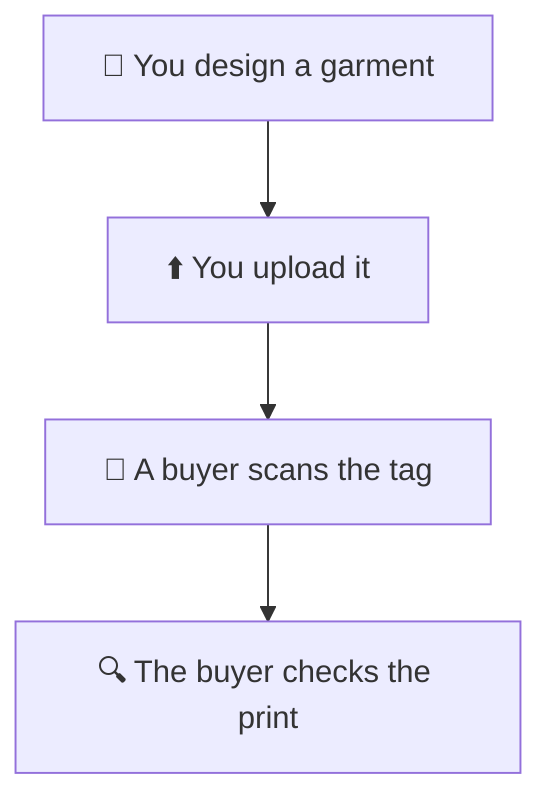

# 👋 Start here — the picture guide

> **What is this?** Short pages with pictures for the RUN team.
> They show how a garment gets onto a phone in 3D.
> You do not need to know any code to read them.
> Hard words are explained in [Words we use](glossary.md).

## 📖 The pages

| Page | Read it when you want to… |
| --- | --- |
| [How it works](how-it-works.md) | See the whole trip, from design to phone |
| [Upload a garment](upload-a-garment.md) | Put a new garment on the site |
| [When something looks wrong](when-something-looks-wrong.md) | Fix a garment that looks odd |
| [Words we use](glossary.md) | Look up a word you do not know |
| [Our brand](brand.md) | Check our colours, words and tagline |

## 🧵 Why it matters

A buyer scans a tag and turns the garment in 3D.
**The printed logo is the product.**
If the logo looks blurry, the buyer sees a blurry product.
So we always look at the print before we share a link.

## 🗺️ Want every step in detail?

| Page | What it has |
| --- | --- |
| [Staff guide](../STAFF-GUIDE.md) | The long version, with every step |
| [First garment guide](../FIRST-GARMENT-UPLOAD.md) | Your very first upload, click by click |
