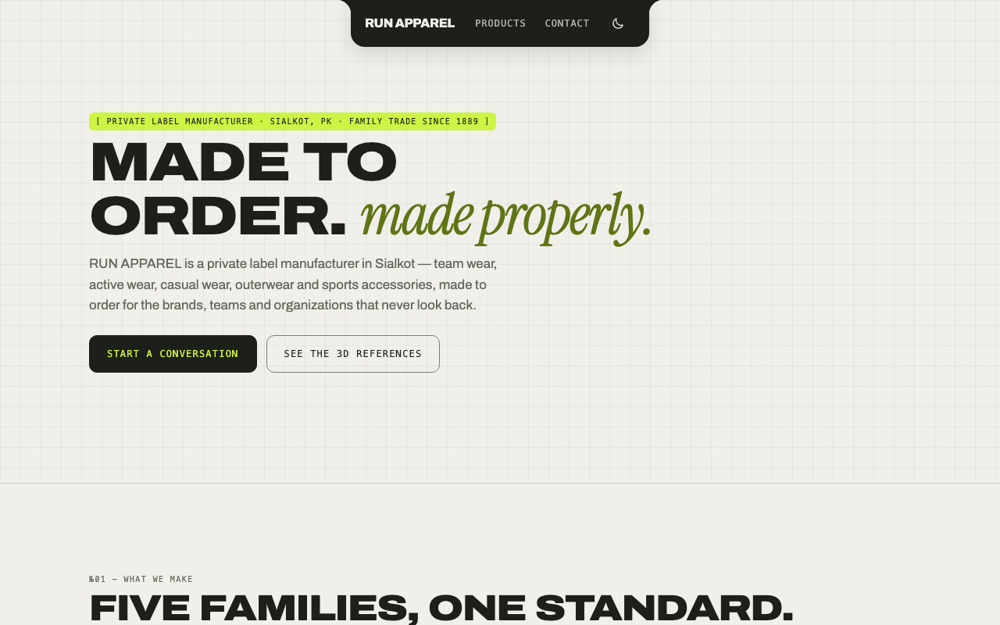
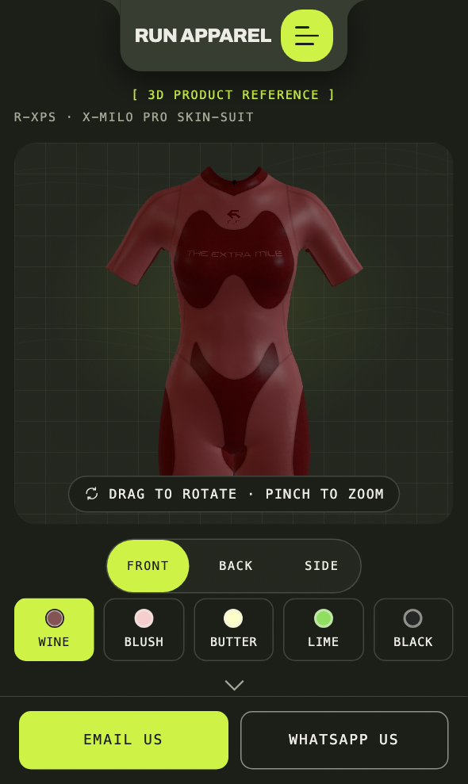

# 🎨 Our brand

> **What is this?** The words and colours RUN APPAREL uses.
> Use them on anything we make, so it all looks and sounds like us.
> Hard words are explained in [Words we use](glossary.md).

## ✍️ Our words

Our tagline has three parts:

> **The Extra Mile | For a Better Tomorrow | Never Look Back**

| Where | How we sound |
| --- | --- |
| Social posts | Bold and short |
| Emails to partners | Warm and helpful |
| Formal papers | Clear, with facts |

We make clothes for brands, teams and companies.
We do not sell to shoppers.
So never write as if we run a shop.

## ⚠️ One rule we never break

RUN APPAREL does not hold any certificates in its own name.
They belong to our parent company, Durus Industries, and to the firms that supply our fabric and trims.
So say we work **within** a certified group.
Never say RUN APPAREL itself is certified.

| ✅ Say | ❌ Never say |
| --- | --- |
| "We work within a certified group" | "RUN APPAREL is certified" |
| "Our fabric comes from certified suppliers" | "We hold this certificate" |

## 🖌️ Our colours: Paper and Ink

| Name | Colour code | Used for |
| --- | --- | --- |
| Paper | `#f1efea` | The light background |
| Ink | `#1d1f1a` | Text and dark buttons |
| Volt | `#cdf345` | Bright labels and buttons |
| Muted | `#63665b` | Quiet, less important text |

These codes come from our design file, [tokens.css](../../packages/ui/src/tokens.css).

## 🌙 Light and dark

The site has a light look and a dark look.
In the dark look, the paper turns dark and the text turns light.
Volt stays the same bright colour in both.

## 🧵 Why it matters

A buyer should know it is us at a glance.
The same words and colours everywhere build that trust.
