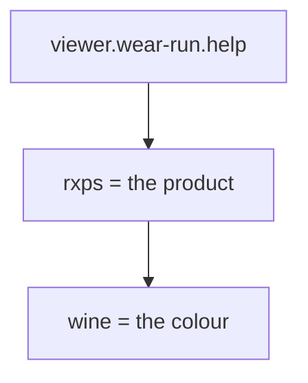

# 📚 Words we use

> **What is this?** Every tricky word from these pages, in plain words.
> The words are in A to Z order.

## 🔤 The words

| Word | What it means |
| --- | --- |
| 3D model | A garment you can turn around on a screen, like a real one in your hand |
| Branch | A copy of the code where one change is made, so the main copy stays safe |
| CLO 3D | The program our team uses to design garments in 3D |
| CMS | The website where we keep our products. Short for "content management system" |
| Colourway | One colour version of a garment, like "wine" or "black" |
| Deploy | Putting a new version of the website live for everyone |
| GLB | A kind of 3D file that a web page can show |
| Pull request | A request to add a change to the main copy of the code |
| QR code | A square barcode. A phone camera opens its link |
| Repository | The folder on GitHub that holds all our code and pages |
| Robot | A computer program that does a job by itself, like shrinking files |
| Slug | The short word in a link, like "wine" in the link below |
| Viewer | The web page that shows a garment in 3D |

## 🔗 A link, piece by piece

```
https://viewer.wear-run.help/rxps/wine
        └─ the viewer ─────┘ └┬─┘ └┬─┘
                      product ┘    └ colour
```



## 🧵 Why it matters

When everyone uses the same words, mistakes are easier to spot.
Back to the [start page](README.md).
