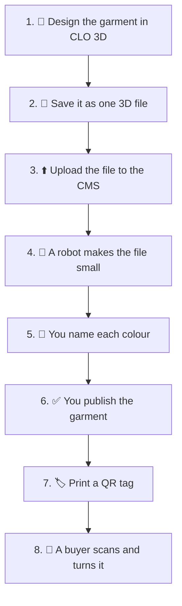
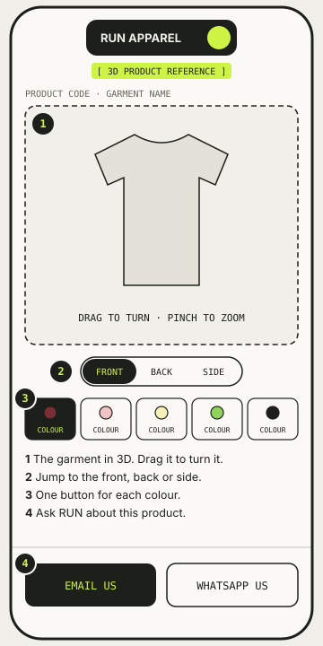

# 🧭 How it works

> **What is this?** The whole trip a garment takes.
> It starts as a design on a computer.
> It ends as a 3D garment on a buyer's phone.
> Hard words are explained in [Words we use](glossary.md).

## 🛣️ The trip, step by step



1. The team designs the garment in CLO 3D (a program for drawing clothes in 3D).
2. You save one file with every colour inside it.
3. You upload it to the CMS (the website where we keep our products).
4. A robot shrinks the file, so it opens fast on a phone.
5. You tell the CMS which colour is which.
6. You publish the garment.
7. You print a QR code (a square barcode a phone camera can read).
8. A buyer scans the code and sees the garment in 3D.

## 🤖 What the robot does

The file from CLO 3D is far too big for a phone.
The robot makes it much smaller.
It keeps the printed logos sharp while it does this.

| Before the robot | After the robot |
| --- | --- |
| Very big file | Small file |
| Slow on a phone | Fast on a phone |
| Every tiny stitch | Only what you can see |

Then the robot saves the small file in our online storage.
The viewer reads it from there.

## 🏷️ Why the QR tag never changes

Each QR tag holds a web link, like this:

```
https://viewer.wear-run.help/rxps/wine
```

The last two words are the product and the colour.
**Once a tag is printed, those words must never change.**
A changed word would break every printed tag.

## 📱 What the buyer sees



The buyer can turn the garment and zoom in.
They can switch colours and ask us a question.
There is no shop and no prices.
It is a reference for our partners, not a store.

## 🧵 Why it matters

Knowing the trip helps you find where a problem started.
A blurry logo might come from the design, the upload or the robot.
The page [When something looks wrong](when-something-looks-wrong.md) helps you check each one.
