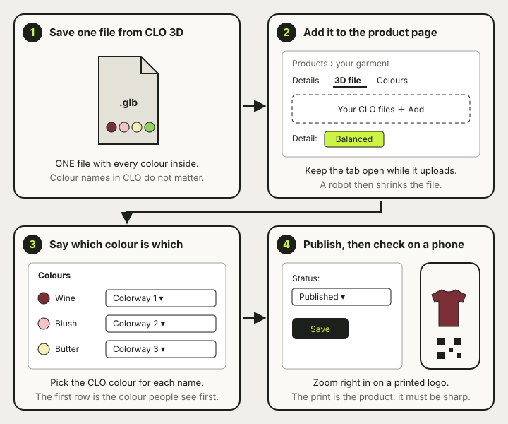
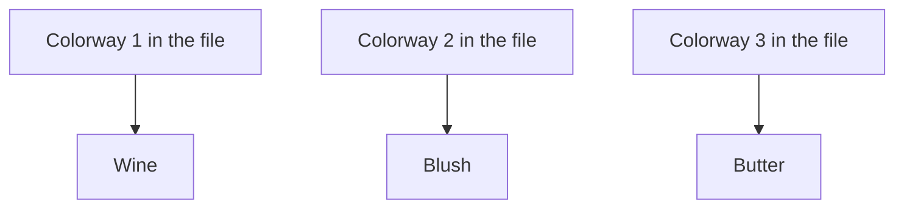

# ⬆️ Upload a garment

> **What is this?** The four steps to put a new garment on the site.
> Each step has a picture.
> The full steps, with every button, are in the [first garment guide](../FIRST-GARMENT-UPLOAD.md).
> Hard words are explained in [Words we use](glossary.md).



## 1️⃣ Save one file from CLO 3D

Make **one** file with every colour inside it.
Save it as a GLB file (a 3D file a web page can show).
The colour names inside CLO 3D do not matter.

| Do | Do not |
| --- | --- |
| One file with every colour | One file per colour |
| Save as GLB | Upload the CLO project file |

## 2️⃣ Add it to the product page

Open the CMS (the website where we keep our products).
Go to **Products** and open your garment.
Click the **3D file** tab.
Add your file under **Your CLO files**.
Leave **Detail** on **Balanced**.

| Click | What you see |
| --- | --- |
| **Products** | A list of our garments |
| Your garment | Its page, with tabs on top |
| **3D file** tab | The place to add your file |

Keep the tab open until the upload ends.
Then a robot shrinks the file for you.

## 3️⃣ Say which colour is which

When the status says **Ready to review**, open the **Colours** tab.
Each colour asks: *"Which colour in your CLO file is this?"*
Pick the right one from the list.



The first colour in the list is the one buyers see first.

## 4️⃣ Publish, then check on a phone

Set **Status** to **Published** and click **Save**.
Open the garment's link **on your phone**.
Zoom right in on a printed logo.
It must be sharp.


## 🏷️ Last step: the QR tag

Make a QR code (a square barcode) from the garment's link.

```
https://viewer.wear-run.help/<product>/<colour>
```

Print it at least 2 cm wide.
**Scan the printed tag with a real phone** before you send it out.
The [staff guide](../STAFF-GUIDE.md) shows how to make one.

## 🧵 Why it matters

Buyers judge the garment by its print.
Checking on a real phone is the only way to see what they see.
