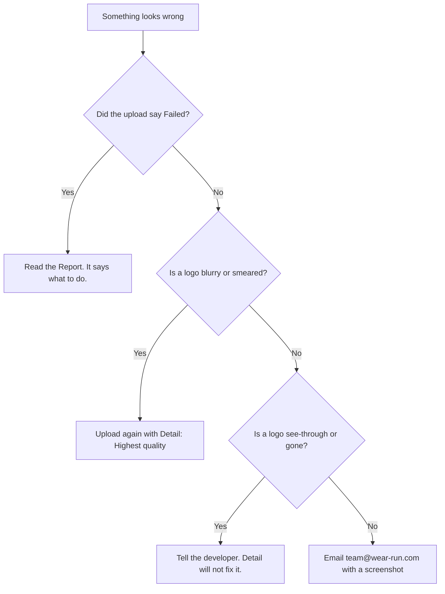

# 🔍 When something looks wrong

> **What is this?** A quick list of problems and what to do.
> Start at the top and stop when you find your problem.
> Hard words are explained in [Words we use](glossary.md).

## 🚦 First, find your problem

## 📋 What the Report might say

| The Report says | What you do |
| --- | --- |
| The file is too big | Save it again from CLO 3D with less detail |
| "did not finish uploading" | Try again and keep the tab open |
| "must be GLB models" | Save a GLB file from CLO 3D |
| "no colour picked" | Answer each colour on the Colours tab |
| "Something went wrong." | Tell the developer. This one is a bug. |

The full list is in the [first garment guide](../FIRST-GARMENT-UPLOAD.md).

## 📱 A garment looks fine on a computer but not on a phone

Always check on a real phone.
Zoom right in on each printed logo.

If the site does not open at all, it may be down.
Email **team@wear-run.com** and say which link you opened.

## 🏷️ An old QR tag shows a different colour

That colour was switched off in the CMS (the website where we keep our products).
Old tags still work.
They show the main colour and a short note.
This is on purpose, so no printed tag ever breaks.

| What happened | What the buyer sees |
| --- | --- |
| Colour switched off | The main colour, plus a note |
| Colour still on | That exact colour |

## 🧵 Why it matters

A fast answer keeps a buyer's first look a good one.
The developer's notes on print problems are in the [artwork case file](../OPEN-ISSUE-ARTWORK.md).
