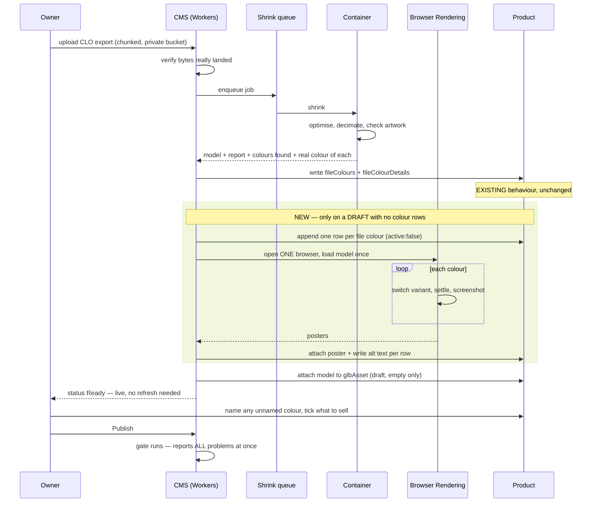

# CMS UX redesign — cms.wear-run.help

**Status:** proposed, awaiting sign-off. No code written.
**Date:** 2026-08-10
**Scope:** the admin experience only. The shrink pipeline, the publish gates and
the viewer's rendering are not being redesigned — they work, and several of them
are load-bearing safety.

---

## The goal, stated as the owner states it

> Upload media (including 3D files) → create a new product → add all product
> info → select media → auto-generate colourway names, with manual override.

**Measured against a catalogue of 100+ garments at under 10 colours each**
(confirmed by the owner, 2026-08-10). That number is what separates this design
from the one that would have been right for ten garments: at this scale the
dominant cost is *repetition*, not any single upload.

---

## Where we are (2026-08-10)

| Area | Score | One-line reason |
|---|---|---|
| Product creation flow | 80 | Excellent labels and validation; still types three fields where one would do. |
| Media upload (2D) | 70 | Well guarded, but one image size for all devices, no folders, no auto-description. |
| 3D upload / viewer integration | 85 | Automatic end to end and now self-attaching; no progress, no in-CMS look at the result. |
| Colourway / variant handling | 80 | Colours measured from the file, never guessed — ahead of commercial tools. Import is a button you must find. |
| Publish gating / validation | 90 | Pure, unit-tested, names the colour at fault. Reports one problem per save. |
| Admin UX / usability | 68 | The writing is superb; the shell is stock. No landing guidance, no readiness view, no preview. |
| Deployment & infra | 88 | Backed up, rollback tested, migrations replayed, outside monitors live. |

**Overall CMS: 82/100.** The machinery is finished; the cockpit is not.

---

## What research says (August 2026)

**Payload admin UX.** Payload is code-first: the admin is exactly as good as the
schema someone wrote, and minimal out of the box compared with Sanity or
Storyblok. Three mechanisms are current practice and all exist in the pinned
3.86.0:

- **Live Preview** — the real site in an iframe beside the form, synced by
  `postMessage`.
- **Composable dashboard** (v3.79+) — the home screen is a grid of widgets.
- **`beforeDocumentControls`** — a slot beside Save for status and checklists.
- **Folders** (`admin.folders: true`) — nested grouping across collections.
  ⚠️ Documented as **beta**, "subject to change in minor version updates."

**3D asset management in PIM/DAM.** The 2026 consensus is native GLB/USDZ
handling, automatic optimisation on ingest, routing assets through a 3D QA and
approval workflow, structured metadata as the backbone, and version history with
rollback. **This repo already has four of those five.** The missing one is
version history, and `versions: false` is a deliberate, documented D1 cost
decision that this design does not touch.

**AI colourway naming.** The 2026 market is almost entirely AI *re-colouring of
photographs*, not naming. Nothing credible sells "point an AI at a garment and
get a colour name." The existing method — dominant fabric by surface area,
linear→sRGB conversion, CIEDE2000 against a named palette, and a refusal to name
anything low-confidence — is **ahead of the commodity tooling**. The owner chose
to extend it rather than replace it with an AI. This design does that.

Sources are listed at the foot of this document.

---

## Decisions taken (owner, 2026-08-10)

| Question | Answer |
|---|---|
| Auto-generate per-colour photos? | **Yes, via Cloudflare Browser Rendering.** |
| Colour naming method? | **Keep measuring. No AI.** Extend the palette and auto-fill more fields. |
| Live preview inside the CMS? | **Yes** — accepting the `frame-ancestors` relaxation. |
| Scale | **Under 10 colours per garment; 100+ garments.** |

---

## Constraints this design must respect

These are measured facts about the stack, not preferences. A plan that ignores
any of them does not survive contact with the repo.

1. **`sharp` cannot run on Cloudflare Workers.** Media has no `imageSizes` for
   this reason. Responsive images need Cloudflare Images or a pre-upload step —
   not a Payload config change.
2. **The viewer sends `frame-ancestors 'none'`** (`apps/viewer/scripts/csp.mjs`).
   Live Preview is an iframe, so it is blocked today. Relaxing to
   `frame-ancestors 'self' https://cms.wear-run.help` is a one-line, narrow
   change — and it is a security decision, now taken.
3. **The shrink container has no browser.** Verified against
   `apps/shrink/Dockerfile`. Poster rendering cannot happen inside it without
   adding Chromium to the image (slow builds, more container time). Cloudflare
   Browser Rendering is the stack-native route.
4. **Browser Rendering budget: 10 browser-hours/month included** on Workers Paid,
   then $0.09/browser-hour. **Batch one browser session per garment**, load the
   model once, switch variants, screenshot each — ~1.7 hours for a 100-garment
   catalogue. Per-*colour* sessions would cost roughly 5× the same output.
5. **Container budget: ~40–60 shrink jobs/month at $0 extra.** 100 garments
   spread over a year is ~8/month and fits. A bulk load of 100 in one month does
   not. Stage the intake.
6. **`apps/cms` is pinned to TypeScript 6.0.3** — Next.js 16 rejects 7.x. Any
   new admin component is written against 6.
7. **Colourway slugs are printed on physical QR tags.** No automated process may
   ever rewrite one. Row order decides the default colourway, so nothing may
   reorder rows. Both invariants are already enforced and tested in
   `importColours.ts`; every addition below inherits them.
8. **`GATED_FIELDS` exists to stop the robot's own writes being refused.** Any
   new automated write to a product must repeat the shrink worker's safety
   argument: draft only, and only when the field is empty.

---

## The proposed flow

### Diagram 1 — the journey, and where automation takes over

```mermaid
flowchart TD
    A["Owner creates a product<br/>types the NAME only"] --> B{{"AUTO: web address word<br/>+ product code suggested<br/>editable, create-time only"}}
    B --> C["AUTO: shared copy pre-filled<br/>from Catalogue Defaults<br/>steps, catalogue link, retired message"]
    C --> D["Owner uploads the CLO file<br/>on the 3D file tab"]
    D --> E["AUTO: shrink robot runs<br/>380 MB → ~30 MB"]

    E --> F{{"AUTO: reads the colours<br/>inside the file<br/>measures each real colour"}}
    F --> G{{"AUTO: adds a colour row<br/>per file colour<br/>switched OFF, name + swatch filled"}}
    G --> H{{"AUTO: takes a photo<br/>of every colour<br/>one browser, one model load"}}
    H --> I{{"AUTO: writes the photo<br/>description from<br/>product name + colour name"}}
    I --> J{{"AUTO: attaches the model<br/>to the draft product"}}

    J --> K["Owner reviews:<br/>fixes any unnamed colour,<br/>ticks which colours to sell"]
    K --> L["Readiness panel shows<br/>EVERYTHING still missing,<br/>all at once"]
    L --> M["Live preview:<br/>the real page, beside the form"]
    M --> N["Publish"]

    style B fill:#cdf345,stroke:#5f7414,color:#1d1f1a
    style C fill:#cdf345,stroke:#5f7414,color:#1d1f1a
    style F fill:#cdf345,stroke:#5f7414,color:#1d1f1a
    style G fill:#cdf345,stroke:#5f7414,color:#1d1f1a
    style H fill:#cdf345,stroke:#5f7414,color:#1d1f1a
    style I fill:#cdf345,stroke:#5f7414,color:#1d1f1a
    style J fill:#cdf345,stroke:#5f7414,color:#1d1f1a
```

Green = the computer does it. White = the human does it. **Every green step is
overridable and none of them switches a colour on.**

### Diagram 2 — what happens after the file lands, in order

---

## The work, in four phases

Ordered so each phase is shippable alone and the earliest ones pay back fastest.

### Phase 1 — The cockpit (highest value per hour)

| # | Change | Where |
|---|---|---|
| 1.1 | **Readiness panel** on the product: a live list of what is still missing before Publish, ticking itself as you fill things in. | New UI field + `beforeDocumentControls` slot |
| 1.2 | **Report every publish problem at once.** `assertPublishable` currently throws on the first failure, so three missing things cost three save attempts. Collect and throw one combined message. | `publishGating.ts` — pure, fully unit-tested already |
| 1.3 | **Live status** on the raw upload — poll while Queued/Processing so the row moves without a manual refresh. | Custom cell component |
| 1.4 | **Auto-derive the web address word** from the product name, **on create only**, editable, never rewritten on update. | `Products.ts` field hook |

⚠️ 1.2 changes the text of messages that `publishGating.test.ts` asserts. That
test file is the spec; it gets updated deliberately, not incidentally.

### Phase 2 — Scale foundations (only needed because of 100+ garments)

| # | Change | Where |
|---|---|---|
| 2.1 | **A `Catalogue Defaults` global** holding the copy that is identical on every garment — the "How we build your product" steps, the catalogue link, the retired-colour message. Products inherit and may override. | New global + `defaultValue` hooks |
| 2.2 | **Duplicate a product** as a starting point for the next one. | Payload's built-in duplicate action |
| 2.3 | **Folders on Media** so ~1,000 files stay navigable. | `admin.folders: true` — ⚠️ beta; decide explicitly whether that is acceptable here |
| 2.4 | **A dashboard** that answers "what do I do now?" — drafts waiting, uploads processing, products blocked from publishing. | Custom admin view |

### Phase 3 — Automation the owner asked for

| # | Change | Where |
|---|---|---|
| 3.1 | **Auto-import colour rows** when a file's colours arrive — same safety argument as the model auto-attach: draft only, only when there are no rows yet, every row `active: false`. The manual "Add the ticked colours" button stays for every other case. | `apps/shrink/src/index.ts` + `importColours.ts` (pure logic already exists and is tested) |
| 3.2 | **Auto-photo per colour** via Cloudflare Browser Rendering. **One browser session per garment**, model loaded once, variant switched per colour. | New Worker route |
| 3.3 | **Auto photo description** — `"{productName} in {colourName}"`, written only into an empty field, always editable. | Field hook |
| 3.4 | **Widen the colour palette** in `colour-name.ts` so fewer colours land as "needs a name". Pure change, pure test. | `tools/asset-pipeline/src/colour-name.ts` |
| 3.5 | **Auto-map an obvious colour** — if a row is called "Wine" and the file holds a colour measured as wine, pre-select it. Suggestion only; never overwrites an existing choice. | `SourceVariantSelect.tsx` |

**None of 3.1–3.5 may switch a colour on, rewrite a slug, or reorder rows.** Those
three rules are already enforced and tested in `importColours.ts`; every addition
inherits them.

### Phase 4 — Preview and delivery

| # | Change | Where |
|---|---|---|
| 4.1 | **Relax `frame-ancestors`** to `'self' https://cms.wear-run.help`. Pinned by the existing CSP test. | `apps/viewer/scripts/csp.mjs` |
| 4.2 | **Live Preview** panel on the product. | `admin.livePreview` |
| 4.3 | **Responsive images.** Needs Cloudflare Images or a pre-upload resize step — `sharp` cannot run on Workers. Costs money; decide separately. | Out of Payload's hands |

---

## Explicitly NOT proposed, and why

- **An AI to name colours.** The measured method is better and cheaper, and a
  confidently wrong name is precisely how a maroon garment shipped as "Navy".
- **Turning on document versions.** `versions: false` is a deliberate D1 cost
  decision recorded in three collections.
- **Dropping the two unused database columns** (`presentation_mode`,
  `variant_mapping`). A D1 table rebuild is the single most hazardous operation
  in this repo.
- **Rendering posters inside the shrink container.** Adding Chromium to that
  image makes every pipeline change a slow rebuild.
- **A multi-step wizard replacing the tabs.** The tabs already read top to
  bottom; a wizard would fight Payload's document model for no gain.

## Open item this design does not solve

**Per-garment artwork proof does not scale to 100 garments.** Every garment gets
the three automatic structural gates plus the synthetic deploy check — those are
garment-agnostic and cost nothing. What does *not* scale is
`eval:artwork:real`-style calibration: choosing camera views and a damage ceiling
per garment is roughly half an hour of human attention each, and 100 of those is
a working week. This is a decision to take deliberately, not a task to schedule:
either accept structural gates as sufficient for garments 2–100, or invest in
making calibration itself automatic. Naming it here so it is not discovered at
garment 40.

---

## Sources

- [Payload CMS Review 2026 — Lucky Media](https://www.luckymedia.dev/insights/payload-cms)
- [Headless CMS 2026: Sanity vs Contentful vs Payload — DigitalApplied](https://www.digitalapplied.com/blog/headless-cms-2026-sanity-contentful-payload-comparison)
- [Custom Admin Panels With Payload CMS — FocusReactive](https://focusreactive.com/payload-cms-admin-panel/)
- [Payload docs — Live Preview](https://payloadcms.com/docs/live-preview/overview)
- [Payload docs — Edit View / beforeDocumentControls](https://payloadcms.com/docs/custom-components/edit-view)
- [Payload docs — Folders](https://payloadcms.com/docs/folders/overview)
- [Digital Asset Management Best Practices 2026 — VNTANA](https://www.vntana.com/3d/digital-asset-management-best-practices/)
- [3D & AR/VR Digital Asset Management Best Practices — Pimberly](https://pimberly.com/blog/3d-ar-vr-digital-asset-management-best-practices/)
- [3D Digital Asset Management — 3D Cloud](https://3dcloud.com/3d-asset-management/)
- [Managing Product Content Workflows with DAM and PIM — Acquia](https://www.acquia.com/blog/dam-pim-product-content-workflows)
- [Browser Rendering API pricing — Cloudflare changelog](https://developers.cloudflare.com/changelog/post/2025-07-28-br-pricing/)
- [Browser Rendering limits — Cloudflare docs](https://developers.cloudflare.com/browser-run/limits/)
- [Best AI Tools for Product Colour Variants 2026 — Nightjar](https://nightjar.so/blog/best-ai-tools-color-variants-product)
- [Clothing Colorways Generator — Style3D AI](https://www.style3d.ai/ai-fashion-design/clothing-colorways)
